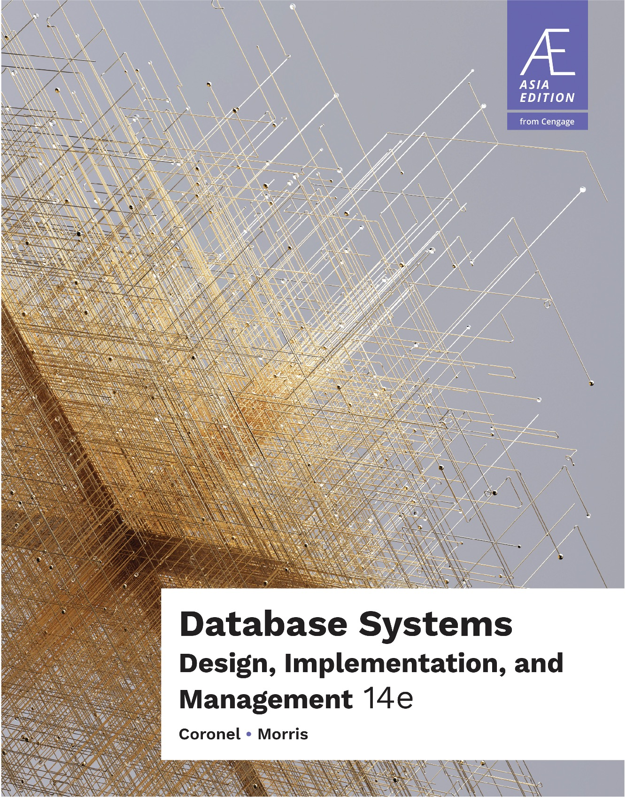
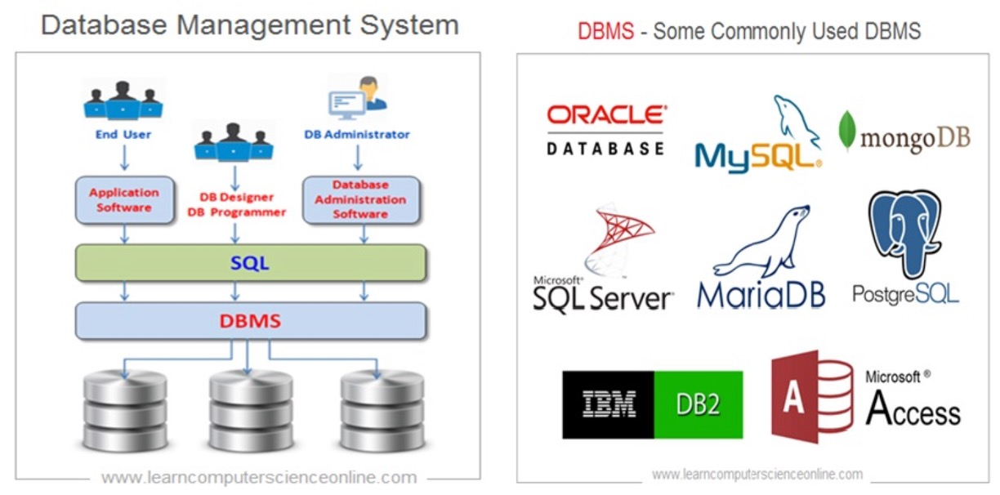
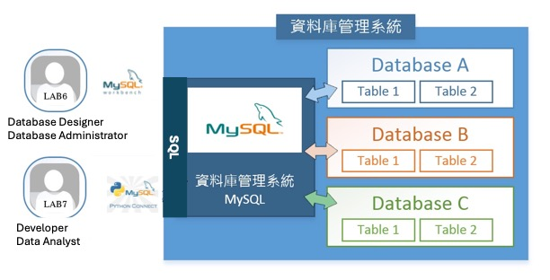

# 資料庫管理
- 講師：林志偉
- 教材：https://github.com/mingfujacky/Lecture-Database.git

# Textbook

- Database Systems Design, Implementation, and Management 14/E
- Coronel & Morris
- Cengage, 2023

# 課程講師 - 林志偉 (Jacky Lin)

- #### 現職: 陽明交通大學 / 學士後電子與光子學士學位學程 助理教授
- #### 學歷: 交大資訊管理博士
- #### 經歷: 台積電資訊科技(IT)
- #### 專長: 資料工程、程式設計、巨量資料分析
- #### Email: jacky.jw.lin@nycu.edu.tw

# 課程助教

## 電子與光子學程
- 黃千晏 so3355589@gmail.com
- 謝勵維 hsiehliwe.sc12@nycu.edu.tw

## 資材系
- 林思圻 lulubbyg.mg13@nycu.edu.tw
- 林宸絨 nycuiim20020611@gmail.com

# 生活中怎麼表達資料庫概念
[Excel Files vs Database](https://youtu.be/7yYbbKyyHvw?si=Y3vrhXjLHS4FGtkN)

# Database Position in 3 Tiers Architecture

# DBMS and Its Products
- DBMS: Database Management System
- SQL: Structured Query Language

# 課程規劃
- #### 課程目標
  *-* Introduce database design process and SQL programming.
  *-* Use Python and MySQL to practice data manipulation and sharpen SQL skill.
- #### 授課方式
  *-* 教材講解
  *-* 課堂 Lab 實作 (week 9, 10, 11 上課請攜帶電腦)

# 評分方式
- Attendance(10%): roll call and QA 
- Homework (20%): 4 times
- Mid-term exam (20%): closed-book exam
- Final-term exam (20%): closed-book exam
- Project (30%): 
  - group by 3 ~ 6 members
  - form team by week 3
  - hand-in progress report by week 9
  - selective groups presentation in week 15
  - hand-in final report by week 17

# Members in Project
- **End user**: define business rule and function requirements 
- **Database designer**: translate user requirements into database design
- **Database administrator**: realize database design in DBMS
- Data analyst: reporting and investigation
- Developer: develop user interface
- Project manager: team organization, schedule control and communication

# 時時實際操作
 
"我鼓勵你使用鍵盤手動複製這些程式，而不是直接將其原始程式碼複製貼上到新檔案中；這有助於你對程式產生「肌肉記憶」，並迫使你在鍵入時考慮每一行。"

# 授課大綱
[113下學期](https://timetable.nycu.edu.tw/?r=main/crsoutline&Acy=113&Sem=2&CrsNo=520015&lang=zh-tw)

# Database Design Process≠≠≠≠≠

# Software We Use in Class

# 加簽順序
- 資財系 > 雙主修輔系資財系 > 管科系、運管系 > 跨域(財金跨域) > 一般
- 五年級 > 四年級 > 三年級 > 二年級 