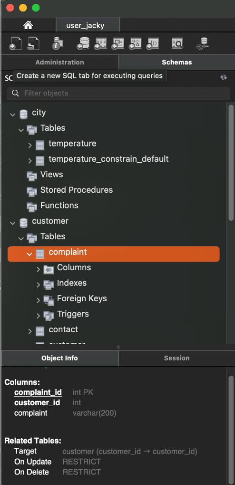

# Chapter 1: Database Systems
- Organizations use data to keep track of their day-to-day operations. Such data is used to generate information, which in turn is the basis for good decisions. 
- Data is likely to be managed most efficiently when it is stored in a database.

---
# Why Database
- Databases evolved from the need to manage **large amounts** of data in an **organized and efficient** manner
- Databases is everywhere

---
# DIKW Pyramid
- **Data** consists of raw facts
- **Information** is about adding context to reveal the meaning of data
- **Knowledge** is about how to use the information
- **Wisdom** is about when to take action

---
# Data versus Information
- Information is the result of processing raw data to reveal the meaning of data
- **Data management** is a discipline that focuses on the proper generation, storage, and retrieval of data

---
# Introducing the Database
- A **database** is a collection of related data.
  - represent a **mini-world** to reflect some aspect of the real world
  - **logically coherent** collection of data with some inherent meaning
  - is designed, built, and populated with data for **a specific purpose**
- A **database management system (DBMS)** is a collection of programs that manages the database structure and controls access to the data stored in the database. Here, the database refers to a shared, integrated computer structure.
- Examples of DBMS: MySQL, Microsoft SQL Server, Oracle Database, MongoDB, Cassandra, Neo4j, ...

---
# Role and Advantages of DBMS
- DBMS presents the end user with a single, integrated view of the data in the database
- DBMS advantages:
  - Improved data sharing
  - Improved data security
  - Better data integration
  - Minimized data inconsistency
  - Improved data access

---
# Types of DBMS
- by # of users: single-user, multiple-user 
- by location: centralized, distributed, cloud
- by time sensitive: online transaction processing (OLTP), online analytical processing (OLAP)
- by data characteristics: SQL store structured data, NoSQL store unstructured and semi-structured data

---
# Why Should We Learn Database Design
- **Database design** refers to the activities that focus on the design of the database structure that will be used to store and manage end-user data
- Poorly designed databases can lead to slow performance, data integrity issues, security vulnerabilities, and challenges in scaling applications.

---
# Database Design Process
- Requirements & Analysis: discover users requirements, analyze what data should be maintained
- Conceptual model: create a model that represents mini-world objects and their relationships.
- **Choice of a DBMS**
- Logical model: adapts the conceptual model to a specific DBMS implementation model.
- Physical model: create database keys, constraints, indexes, and other RDBMS features
- Implementation: realize physical model on running environment and optimize performance

---
# A Good Database Design Following Database Design Process

---
# Database Application Environment
Defines and regulates the collection, storage, management, and use of data within a database environment, including:
- Hardware
- Software
- People
- Procedures
- Data

---
# DBMS Functions
- Data dictionary management to store definitions of data elements and their relationships
- Data storage management
- Security management
- Transaction management and concurrent control
- Backup and recovery management
- Data integrity management
- SQL languages (structured query language)
- Database communication API (application programming interfaces)

---
# Disadvantages of DBMS
- Increased costs
- Management complexity
- Maintaining currency (operation expertise and man power)
- Vendor dependency (vendor lock-in)
- Frequent upgrade/replacement cycles

---
# Database Professional Career

Job Title|Description|Sample Skills Required
---------|-----------|----------------------
Developer | Develop application | Programming, SQL
DBA| Design, manage DBMS | DBMS fundamentals, SQL
Database Designer | Design data models | Domain knowledge, data modeling, DBMS fundamentals, SQL
Data Security Officer | Enforce data security rules| DBMS fundamentals, data security
Data Analyst / Data Scientist | Analyze varied data to generate insights and prediction | Data analysis, statistics, SQL / programming, ML / AI, data visualization

---
# When Not to Use a DBMS
- WHen costs can not be justified: H/W, S/W, operations  
- When a DBMS may be unnecessary: simple applications, limited users
- When a DBMS may be infeasible: embedded systems
- When no DBMS may suffice: real-time requests, complexity of data, special operation

---
# Review Questions
- What is a database 
- What is a DBMS
- What is a Database Application Environment
- Explain DIKW model
- Which database professional career you are interested in?