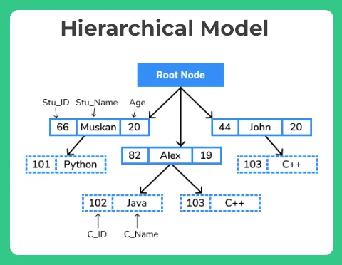
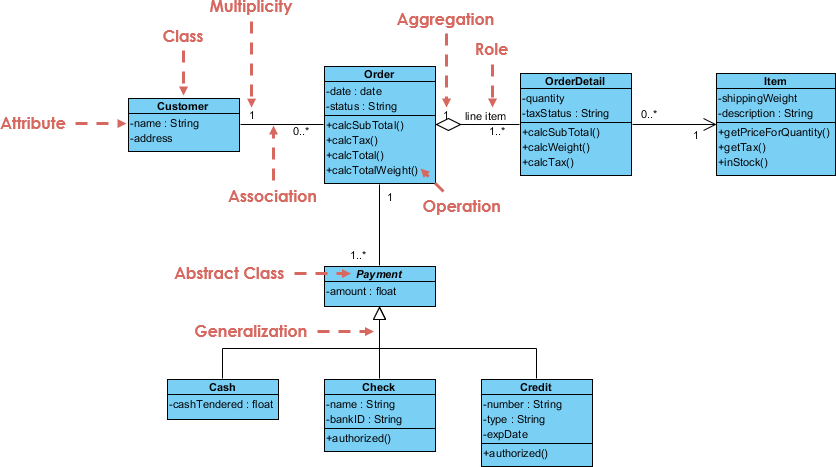

# Chapter 2: Data Models
- Data modeling is to build data models, which is the first step in the database design journey, serving as a bridge between real-world objects and the computer database.
- One big problem of database design is that designers, programmers, and end users see data in different ways, which introduce misunderstanding and increase communication cost.
- Database designers must obtain a precise description (data model) of the data's nature and environments within the organization.
- **Data modeling clarifies such communication by reducing the complexities of database design to more easily understood abstractions that define entities, relations, and data transformations.**

# Data Modeling and Data Models
- Data modeling refers to the **process** of creating a specific data model for a determined problem domain (mini-world). Data modeling is an iterative, progressive process.
- A data model is a relatively simple representation of more complex real-world data structures
  - Entity
  - Attribute
  - Relationship
  - Constrain

# The Importance of Data Models
- Data models are a communication tool
  - End users know the business rule running in real world
  - Developers develop aps to manage data and transform data into information
  - But data is viewed in different ways by different people
    - Managers want a universal view of data
    - Staffs need details of data
- A good database application environment requires an overall database blueprint based on an appropriate data model
- When a good database blueprint is available, it does not matter that an applications developers' view of the data is different from that of the manager or the staff
- No appropriate data model, no good database application environment

# Data Model Basic Building Blocks
- An **entity** is a person, place, thing, concept, or event about which data will be collected and stored
- An **attribute** is a characteristic (attribute or field) of an entity
- A **relationship** describes an association among entities
  - One-to-many (1:M or 1..*) relationship *PAINTER paints PAINTING*
  - Many-to-many (M:N or \*..\*) relationship *EMPLOYEE learn SKILL*
  - One-to-one (1:1 or 1..1) relationship *EMPLOYEE manage STORE*
- A **constraint** is a restriction placed on the data to help data integrity
  - An employee’s salary must have values that are between 6,000 and 350,000
  - A student’s GPA must be between 0.00 and 4.00
  - Each class must have one and only one teacher

# Business Rules
- A **business rule** is a brief, precise, and unambiguous description of a policy, procedure, or principle within a specific organization
- The main sources of business rules are company managers, policy makers, department managers, and written documentation such as company procedures
- Business rules are used to define entities, attributes, relationships, and constraints
- The business rule 'A customer may generate many invoices' may be translated into data model building blocks
  - Customer and invoice are objects of interest and should be represented by respective *entities*
  - There is a generate *relationship* between customer and invoice
  - The generate relationship is *one-to-many (1:M)*

# Naming Conventions
- Names should be descriptive and familiar to the users
- A good naming convention can 
  - Make less confusion and misinterpretation
  - Reduce errors and time lost
  - Promote code consistently and readability 
- Follow organization practice or develop your owns at the start of project
  - Should table name and column name be singular or plural? (student or students)
  - Should prefix tables or columns? (name or prod_name)
  - Should use capital letters for naming? (cap_cap, capCap or CapCap)
  - Which terminology should be selected? (user, person or people)

# Supplement - Naming Conventions
[Udemy Video of naming conventions](https://youtu.be/xFs8H_YHqHc?si=2m55anO7oxjQ6a8h)
[Naming conventions of MySQL](https://medium.com/@centizennationwide/mysql-naming-conventions-e3a6f6219efe)

# The Evolution of Data Models
Data models represent a lot of thought as to what a database is, what it should do, the types of structures that it should employ, and the technology that would be used to implement these structures

# Hierarchical Models
- The hierarchical model organizes the data into a tree structure which consist of a single root node where each record is having a parent record and many child records and expands like a tree

# Network Models
- In the network model, the user perceives the network database as a collection of records in 1:M relationships. However, unlike the hierarchical model, the network model allows a record to have more than one parent.

# Database Concepts Inherited from Network Model
- The **schema** is the conceptual organization of the entire database, essentially the structural definition of a whole database. Once you claim the schema of a database, it must now no longer be modified often because it will distort the data organization inside the Database. 
- The **data manipulation language (DML)** defines the environment in which data can be managed and is used to work with the data in the database (insert, read, update, delete data)
- A **schema data definition language (DDL)** enables the database administrator to define the schema components (create, drop, alter table, create index or trigger)

# Relational Model
The relational model’s foundation is a mathematical concept known as a relation, which is introduced by Edgar F. Codd in 1969.
- Relation: a table with columns and rows.
- Attribute: a named column of a relation.
- Domain: the set of allowable values for one or more attributes.
- Tuple: a row of a relation

# Relational Diagram

    
    

# Supplement of Relational Model
[Relational model terminology](https://youtu.be/Q45sr5p_NmQ?si=cr53etNXoX1BIpLf)

# Entity Relationship Model
- Although the relational model was a vast improvement over the hierarchical and network models, it still lacked the features that would make it an effective database design tool.
- Database designers prefer to use a graphical tool in which entities and their relationships are pictured.
- The **entity relationship model (ERM)** using *graphical representations* to model database components has become a widely accepted standard for data modeling.
- The relational data model and ERM combined to provide the foundation for tightly structured database design

# Entity Relationship Model Notation
- Entity – an entity is represented in the ERD by a rectangle (entity box)
- Attributes – each entity consists of a set of attributes that describes particular characteristics of the entity
- Relationships – relationships describe associations among data

# Crow's Foot Notations

# Relational Model vs Entity Relationship Model
ER Model first, then converted into Relational Model for DBMS implementation.

|Aspect	| ER Model	| Relational Model
|-------|-----------|-----------------
Used For|	Conceptual database design|	Logical database implementation
Representation|	ER Diagram (graphical)|	Tables (relational schema)
Elements|	Entities, Attributes, Relationships|	Tables, Attributes, Tuples
Constraints|	Cardinality in ER Diagram|	Primary/Foreign keys, SQL constraints
Conversion|	Converted to Relational Model|	Implemented in DBMS

# Object-Oriented Model
In the object-oriented data model (OODM), both data and its relationship are contained in a single structure known as an object
- **Object**: an abstraction of a real-world entity
- **Attributes**: describe the properties of an object
- **Method**: represents a real-world action
- **Class**: a collection of similar objects with shared structure and behavior
- **Inheritance**: an object within the *class hierarchy* to inherit the attributes and methods of the classes above it. (class EMPLOYEE and CUSTOMER can be created as subclasses inherit from the class PERSON)
- OODM are typically depicted using Unified Modeling Language (UML) class diagrams

# OODM Diagram

    
    

# ERDM and O/R DBMS
- The extended relational data model (ERDM) adds many of the OO model’s features within the simpler relational database structure
- A DBMS based on the ERDM is an object/relational database management system (O/R DBMS)

# Emerging Data Models: Big Data and NoSQL
- **Big Data** refers to a movement to find new and better ways to manage large amounts which DBMS can not manage
- Big Data characteristics (3 Vs) : volume, velocity, and variety
- Most frequently used Big Data technologies
  - Hadoop: an ecosystem provides distributed storage and computing framework
  - Hadoop Distributed File System (HDFS) is a fault-tolerant file storage system
  - MapReduce is an distributed computational framework
  - NoSQL database is a large-scale distributed database system that stores unstructured and semi-structured data in efficient ways

# NoSQL Databases
- Schemaless, 
- Horizontal scalability
- Distributed data store
- Lower cost
- Non-relational
- Handle large volume of data

# RDBMS (Relational DBMS) vs NoSQL
|RDBMS|NoSQL
|-----|-----
|Structured data with a rigid schema | Unstructured, Semi-structured data with a flexible schema
|Storage in rows and columns | Data are stored in Key/Value pairs database, Columnar database, Document database, Graph Database.
|Scale up|Scale out
|SQL server, Oracle, mySQL|MongoDB, HBase, Cassandra
|SQL language|Solution-specific method

# Degrees of Data Abstraction
- External, Conceptual, Internal and Physical levels
  

# External Model
- The end users’ view of the data environment
- Use ER diagrams to represent the external model
- The external views represent subsets of the database
  - Easy to **scope** specific data required to support each business unit
  - Easy to **communicate** the model’s adequacy with targeted end users
  - Ensure **security** constraints in the database design
  

# Conceptual Model
- A global view of the entire database by the entire organization
- Use ER diagrams to represent the conceptual model
- The basis for the identification and high-level description of the main data objects
- Independent of both software and hardware
- The term **logical design** refers to creating a conceptual data model 
  

# Internal Model
- Use the database constructs of the chosen DBMS to match the conceptual model’s characteristics and constraints to build the internal model
- Software dependent and hardware independent

# Physical Model
- Operates at the lowest level of abstraction, describing which physical storage device the data is saved and how to access the data
- Both software and hardware dependent

# Levels of Data Abstraction 

# Review Questions
- Why data models are important?
- What are the data model basic building blocks
- How the major data models evolved
- Explain NoSQL characteristics
- What are the four levels of data abstraction

