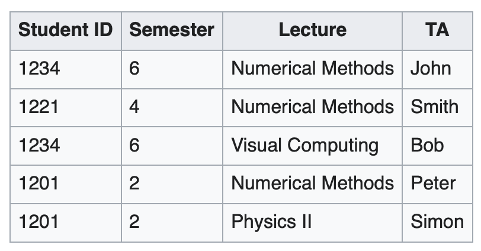

# Chapter3: The Relational Database Model
- Learn about relational database structures like tables, attributes, primary key, foreign key and relationships.
- Learn about how **entity relationship diagrams (ERDs)** can be used to put relational database structures together.

# Tables and Their Characteristics
- A table (relation) is a two-dimensional structure composed of rows and columns
- Each row (tuple) represents a single entity occurrence within the entity set
- Each column (attribute)  has a distinct column name
- Each intersection of a row and column represents a single data value
- All values in a column must conform to the same data format
- Each column has a specific allowable values known as the attribute domain
- Each table must have primary key (PK)  that uniquely identifies each row
- A foreign key (FK) is a primary key of one table that has been placed in another table to illustrate the relationship among tables
- The order of the rows and columns is meaningless

# Relational Database Theory - Functional Dependencies 
- **Functional dependence** means that the value of one or more attributes determines the value of one or more other attributes
- Definition in relational database theory 
  - Given a relation R and attribute sets X, Y ⊆ R , X is said to functionally determine Y (written X → Y) if each X value is associated with precisely one Y value. 
  - X is called the **determinant** or **the key**
  - Y is called the **dependent** 
  
# Example 1 of Functional Dependence

- StudentID value determinate Semester values. The fact can be expressed by a functional dependency:
**StudentID → Semester**.
- If a row was added (StudentID = 1234 and Semester = 5), then the functional dependency would no longer exist.

# Example 2 of Functional Dependence

- STU_NUM → STU_LNAME
- STU_NUM → (STU_LNAME, STU_FNAME, STU_GPA)
- (STU_FNAME, STU_LNAME, STU_INIT, STU_PHONE) → (STU_DOB, STU_HRS, STU_GPA)
- STU_NUM → STU_GPA
- (STU_NUM, STU_LNAME) → STU_GPA

# Full Functional Dependence
- Full functional dependence: an attribute is functionally dependent on a composite key but not on any subset of the composite key.
- STU_NUM → STU_GPA is a full functional dependence 
- (STU_NUM, STU_LNAME) → STU_GPA is a functional dependence, but NOT a full functional dependence   

# Types of Keys
- A key consists of attribute(s) that determine other attributes. 
  - Determinants in functional dependencies is a key.
  - Eg. invoice number identifies all of the invoice attributes, like invoice date and customer name.
  - Composite key: a key composed of more than one attribute
- Key types
  - Superkey: uniquely identify each entity
  - Candidate key: a minimal Superkey (no extra attributes)
  - PK: choice a candidate key as PK to ensure each row in a table is uniquely identifiable
  - FK: establish relationships among tables

# Example of Keys

- Superkey: STU_NUM, (STU_NUM, STU_LNAME), (STU_FNAME, STU_LNAME, STU_INIT)
- Candidate key: STU_NUM
- Primary key: STU_NUM
- FK: DEPT_CODE, PROF_NUM 

# Example of a Simple Relational Database

# Relational Database Keys Comparison
Key Type| Definition
--------|-----------
Super key|Attribute(s) that uniquely identifies each row
Candidate key| Minimal Superkey without extra attributes
Primary key| Select from candidate keys. Uniquely identify row and cannot be NULL
Foreign key | Is a PK of one table that has been placed in another table to illustrate the relationship among tables

# Integrity Rules (完整性規則)
RDBMS rely on integrity rules to ensure data consistency, accuracy, and reliability to prevent errors and enforce business constraints.
- **Entity integrity**
- **Referential Integrity** 
  
# Integrity Rules - Entity Integrity
- Rule: Every table must have a PK, and its value cannot be NULL.
- Reason: Ensures that each row in a table is uniquely identifiable, preventing duplicate or missing records.
- Impact w/o it: A db with missing or duplicate keys could lead to data inconsistency.
- Example: When invoice number is a PK, duplicated invoice numbers or empty invoices number is not allowed. 

# Integrity Rules - Referential Integrity
- Rule: A FK must reference a valid PK in another table.
- Reason: Maintains valid relationships between tables and prevents orphaned records.
- Impact w/o it: If a referenced record is deleted without checking dependencies, it can lead to dangling references.
- Example:  A customer might not yet have an assigned sales representative (allow null), but it will be impossible to have an invalid sales representative (must reference).

# Illustration of Integrity Rules

# Relational Database Theory - Relational Algebra
- **Relational algebra** defines the theoretical way of manipulating table contents using relational operators.
- Eight main relational operators: SELECT, PROJECT, JOIN, INTERSECT, UNION, DIFFERENCE, PRODUCT, and DIVIDE

# Relational Set Operators (SELECT)
SELECT is an operator used to select a subset of rows

# Relational Set Operators (PROJECT)
PROJECT is an operator used to select a subset of columns

# Relational Set Operators (UNION)
UNION is an operator used to merge two tables into a new table, dropping duplicate rows

# Relational Set Operators (INTERSECT)
INTERSECT is an operator used to yield only the rows that are common to two union-compatible tables

# Relational Set Operators (DIFFERENCE)
DIFFERENCE is an operator used to yield all rows from one table that are not found in another union-compatible table

# Relational Set Operators (PRODUCT)
PRODUCT is an operator used to yield all possible pairs of rows from two tables

# Relational Set Operators (JOIN)
JOIN allows information to be intelligently combined from two or more tables
- **Inner join** – only returns matched records from the tables that are being joined
  - Natural join links tables by selecting only the rows with common values in their common attributes (generally DISCOURAGED in practice)
  - Equijoin – links tables on the basis of an equality condition that compares specified columns of each table
  - Theta join – links tables using an inequality comparison operator
- **Left outer join**: yields all of the rows in the first table, including those that do not have a matching value in the second table 
- Right outer join: yields all of the rows in the second table, including those that do not have matching values in the first table

# Natural Join
PRODUCT -> SELECT -> PROJECT

    
    
    
    

# Left Outer Join

    
    

# Right Outer Join

    
    

# Relational Set Operators (DIVIDE)
The DIVIDE operator is used to answer questions about one set of data being associated with all values of data in another set of data
- Determine which customers (on the left), if any, purchased every product shown in P_CODE table (in the middle).

    

# Data Dictionary and the System Catalog
- **Data dictionary** describes all tables in the DB created by the user and designer
- **System catalog** describes all objects within the database
  - Homonym – same name is used to label different attributes 
  - Synonym – different names are used to describe the same attribute. 
  - Both homonym and synonym should be avoided whenever possible 

 
# Relationships within the Relational Database 
- The one-to-many (1:M) relationship is the norm for relational databases 
- In the one-to-one (1:1) relationship, one entity can be related to one and only one other entity and vice versa 
- The many-to-many (M:N) relationship can be implemented by creating a new entity in 1:M relationships with the original entities

# 1:M Relationship

    
    
    
    

# 1:1 Relationship
- 1:1 a professor only chair one department
- 1:M a department employee many professors

    
    

# M:N Relationship
- A M:N relationship is not supported directly in the relational environment.
- M:N relationship can be implemented by creating a new entity in 1:M relationships with the original entities
- In Fig 3.24, the tables create many data redundancies and relational operation become complex and less efficiency  
- 

    
    

# Introduce Composite Entry into M:N Relationship
Table ENROLL is a composite entry (bridge entry, associative entry, link table) to help convert M:N to 1:M
- 

    
    

# Data Redundancy Revisited
- The relational database control of data redundancies through use of foreign keys
- Data redundancy should be controlled except performance and historical data

    
    

# Index to Increase Performance
- An index is an orderly arrangement to logically access rows in a table
- The index key is the reference point that leads to data location identified by the key
- A table can have many indexes, but each index is associated with only one table
- The index key can have multiple attributes

    

# Review Questions
- What is the integrity rules in RDBMS?
- Describe relational database operators to manipulate relational table contents.
- Describe how to deal with M:N relationship.