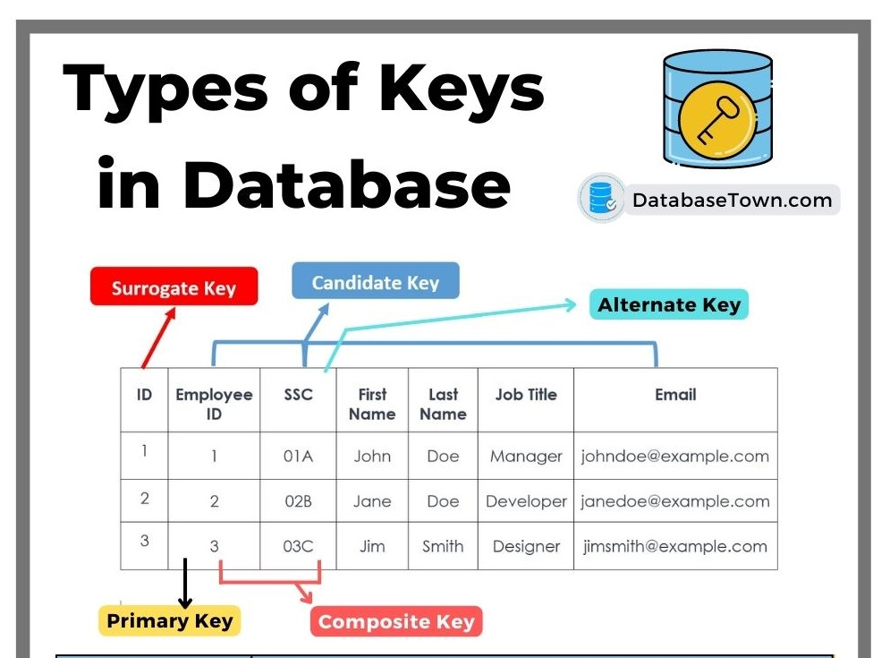

# Chapter5: Advanced Data Modeling
- Main extended entity relationship (EER) model.
- Describe the characteristics of good primary keys and how to select them.
- Data-modeling design cases

# Nulls Created by Unique Attributes

# Extended (Enhanced) Entity Relationship Model (EERM)
- EERM is the result of adding more semantic constructs to the original ER model
- A diagram that uses the EERM is called EER diagram (EERD)

# Entity Supertypes and Subtypes
- The grouping of employees into various types provides the following two benefits:
  - It avoids unnecessary nulls in attributes when some employees have characteristics that are not shared by other employees
  - It enables a particular employee type to participate in relationships that are unique to that employee type
An entity supertype is a generic entity type related to one or more entity subtypes
- The entity supertype (EMPLOYEE) contains common characteristics
- The entity subtype (PILOT, MECHANIC, ACCOUNTANT) contains unique characteristics of each entity subtype

# Specialization Hierarchy
- Higher-level entity supertypes and lower-level entity subtypes
- A subtype can only exist within the context of a supertype
- Every subtype has only one supertype
- A supertype can have many subtypes

# Characteristics of Specialization Hierarchy
- Support attribute **inheritance**
  - Subtypes inherit primary key from supertype
  - Subtypes inherit all attributes and relationships from its supertypes
- Have a special supertype attribute as the **subtype discriminator**, commonly use equality comparison
  - Define **disjoint** or **overlapping** constraints: supertype occurrence appears in one or more subtypes
  - Define **complete** or **partial** constraints: every superset occurrence must be a member of at least one subtype

# Specialization Hierarchy Example

# Entity Clustering
- OFFERING: SEMESTER + COURSE + CLASS
- LOCATION: ROOM + BUILDING

# Entity Integrity: Selecting Primary Keys
- The most important characteristic of an entity is its primary key (a single attribute or a combination of attributes), which uniquely identifies each entity instance.
- The primary key’s function is to guarantee entity integrity
- Primary keys and foreign keys work together to implement relationships in the relational model
- The importance of properly selecting the primary key has a direct bearing on the efficiency and effectiveness of database implementation

# Natural Keys and Primary Keys
- A natural key is a real-world identifier used to uniquely identify real-world objects, which forms part of end user day-to-day business vocabulary
- Usually, if an entity has a natural identifier, a data modeler uses it as the primary key of the entity being modeled 

# Primary Key Guidelines
- Unique values
- No change over time 
- Preferably single-attribute
- Preferably numeric: auto-numbering
- Security-compliant: social secure ID is not good

# When to Use Composite Primary Keys
- As identifiers of composite entities, in which each primary key combination is allowed once in M:N relationship
- As identifiers of weak entities, in which the weak entity has a strong identifying relationship with the parent entity

# When to Use Surrogate Primary Keys (代理鍵)
- A surrogate key is a primary key created by the database designer to simplify the identification of entity instances 
- Surrogate key has no business meaning, with advantages like unique, stability, performance

# Design Case 1: Implementing 1:1 Relationships
