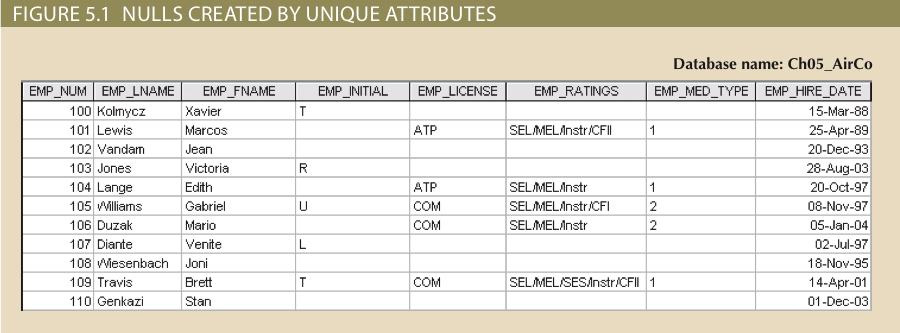
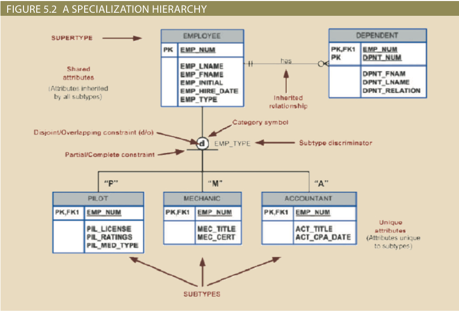
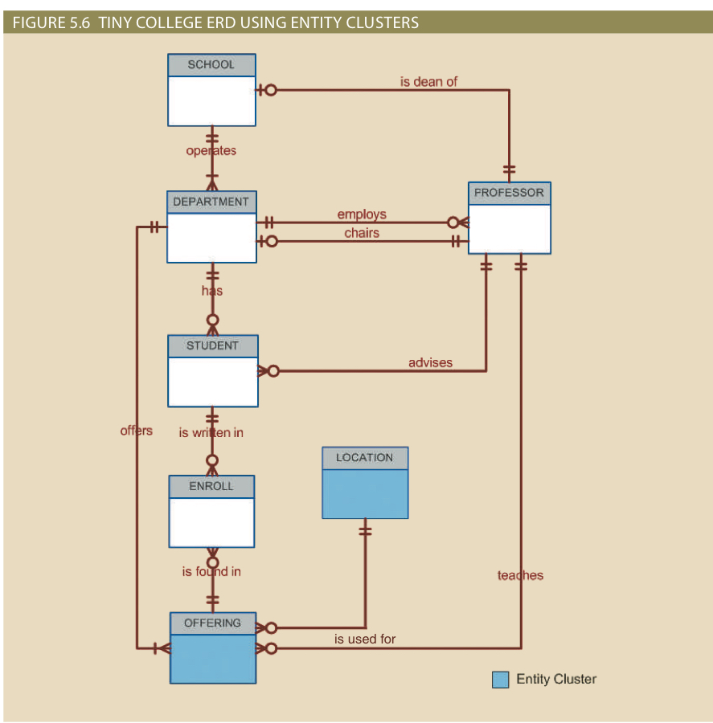
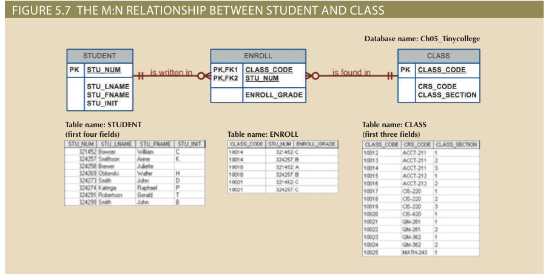
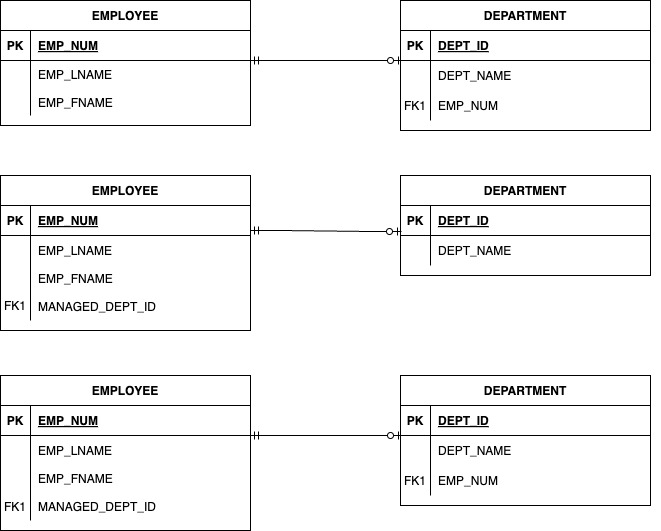
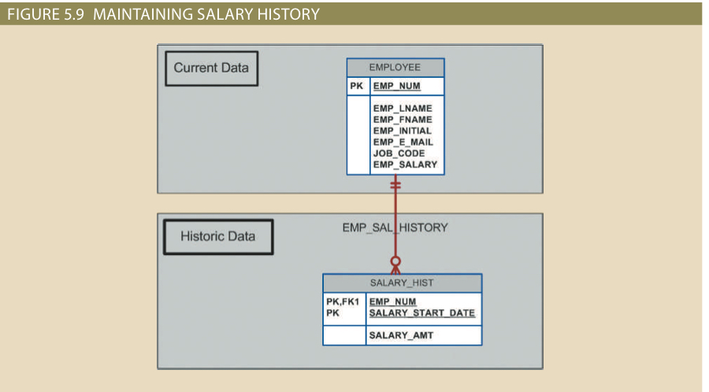
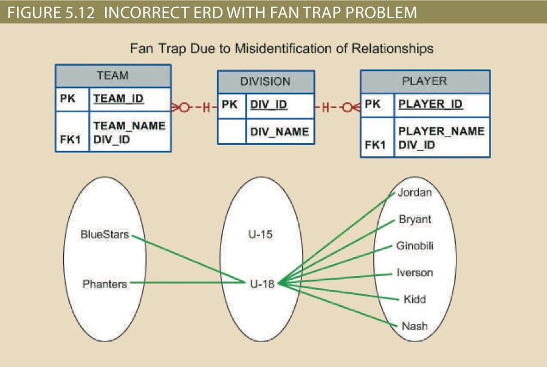
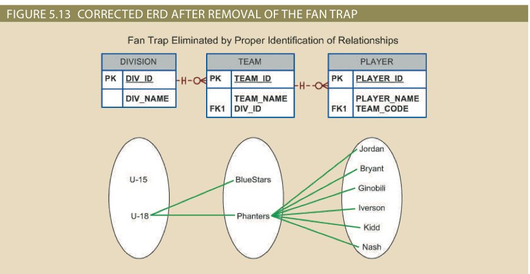
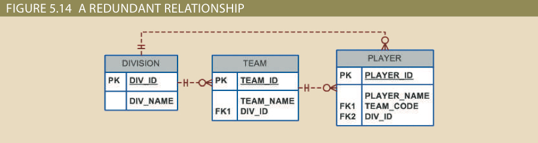

# Chapter5: Advanced Data Modeling
- Illustrate extended entity relationship (EER) model.
- Describe the characteristics of good primary keys and how to select them.
- Data-modeling design cases

# Nulls Created by Unique Attributes

# Extended (Enhanced) Entity Relationship Model (EERM)
- EERM is the result of adding more object-oriented concept to the original ER model
- A diagram that uses the EERM is called EER diagram (EERD)

# Entity Supertypes and Subtypes
- The grouping of employees into various types provides the following two benefits:
  - It avoids unnecessary nulls in attributes when some employees have characteristics that are not shared by other employees
  - It enables a particular employee type to participate in relationships that are unique to that employee type
- The entity supertype (EMPLOYEE) contains common characteristics
- The entity subtype (PILOT, MECHANIC, ACCOUNTANT) contains unique characteristics of each entity subtype

# Characteristics of EERD
- Support attribute **inheritance**
  - Subtypes inherit primary key from supertype
  - Subtypes inherit all attributes and relationships from its supertypes
- Have a special supertype attribute as the **subtype discriminator**, commonly use equality comparison

# Specialization Hierarchy Example

# Entity Clustering (封裝的概念)
- OFFERING: SEMESTER + COURSE + CLASS
- LOCATION: ROOM + BUILDING

# Entity Integrity: Selecting Primary Keys
- The most important characteristic of an entity is its primary key (a single attribute or a combination of attributes), which uniquely identifies each entity instance.
- The primary key’s function is to guarantee entity integrity
- Primary keys and foreign keys work together to implement relationships in the relational model
- The importance of properly selecting the primary key has a direct bearing on the efficiency and effectiveness of database implementation

# Natural Keys and Primary Keys
- A natural key is a real-world identifier used to uniquely identify real-world objects, which forms part of end user day-to-day business vocabulary
- Usually, if an entity has a natural identifier, a data modeler uses it as the primary key of the entity being modeled

Q: Guess the pros and cons of using nature key
[7 Database Design Mistake](https://youtu.be/s6m8Aby2at8?si=LsJyqtws-hEz2UyN)

# Primary Key Guidelines
- Unique values
- No change over time 
- Preferably single-attribute
- Preferably numeric: auto-numbering
- Security-compliant: social secure ID is not good

# When to Use Composite Primary Keys
- As identifiers of composite (bridge, associate) entities, in which each primary key combination is allowed once in M:N relationship
- As identifiers of weak entities, in which the weak entity has a strong identifying relationship with the parent entity

# When to Use Surrogate Primary Keys (代理鍵)
- A surrogate key is a primary key created by the database designer to simplify the identification of entity instances 
- Surrogate key has no business meaning, with advantages like unique, stability, performance

# Design Case 1: Implementing 1:1 Relationships
- Foreign keys work with primary keys to properly implement relationships in the relational model
- The basic rule is to put the primary key of the parent entity on the dependent entity as a foreign key
- Options for selecting and placing the foreign key include the following:
  - Place a foreign key in both entities
  - Place a foreign key in one of the entities 

# Design Case 1: Illustration
A 1:1 relationship:
- An EMPLOYEE manages zero or one DEPARTMENT
- Each DEPARTMENT is managed by one EMPLOYEE

Design comparison
- Fig 1: proper design
- Fig 2: generate many null values
- Fig 3: duplicated work

# Design Case 2: Maintaining Salary History of Time-Variant Data
- Time-variant data refers to data whose values change over time and the data changes must be retained
- Modeling time-variant data, need a new entity with 1:M relationship to the original entity 
- This new entity contains the new value, the date of the change, and any other pertinent attribute
- Question: What is (1) current salary and (2) salary raise history of an employee within a time period
- Discussion: in relationship emp_sal_hist, what cardinality salary_hist is? (0,M) or (1,M) 
 

# Design Case 3: Fan Traps
- A design **trap** occurs when a relationship is improperly or incompletely identified, which is not consistent with the real world
- The most common design trap is fan trap, a type of join path between three tables when a "1-to-M" join links a table which is in turn linked by another "1-to-M" join
- It produces an association among other entities not expressed in the model
  
- Question: Which team the player Jordan belongs to ? 

# Illustration of Design Case 3

Exists a **transitive** relationship between DIVISION and PLAYER via the TEAM entity

# Design Case 4:  Redundant Relationships
- Redundant relationships occur when there are multiple relationship paths between related entities
- The main concern is that they remain consistent across the model
- Some designs use redundant relationships as a way to simplify the design

# Review Questions
- What is an entity supertype, and why is it used?
- What is the most common design trap, and how does it occur?
- Describe the characteristics of good primary keys and how to select them