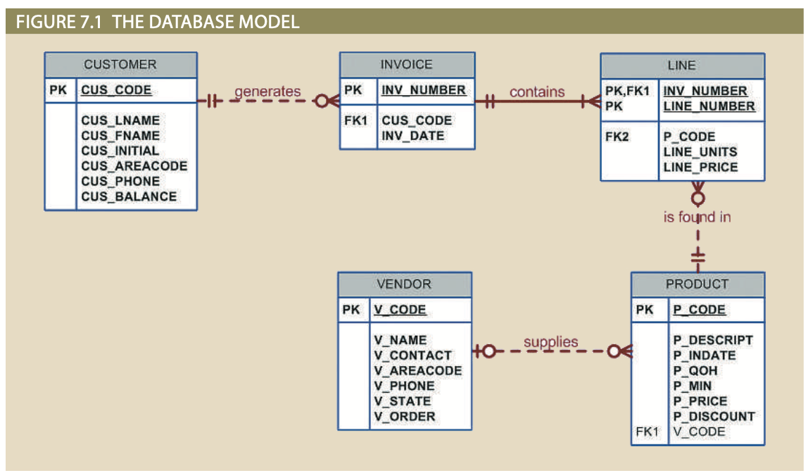
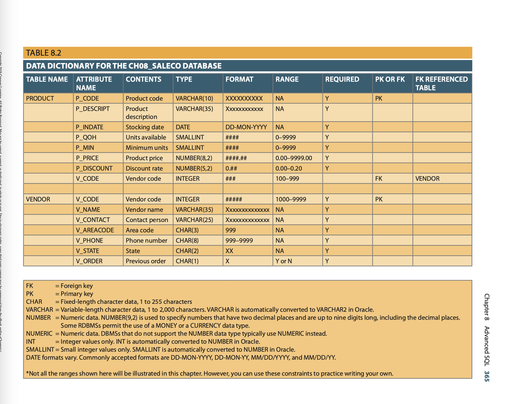

# Introduction to Structured Query Language (SQL)

- SQL is composed of commands that enable users
  - create database and table structures
  - perform various types of data manipulation
  - execute data administration
  - query the database to extract useful information.
- All RDBMS supports SQL, and many software vendors have developed extensions to the basic SQL command set.

# Introduction to MySQL

- MySQL is a relational database management system (RDBMS)
- MySQL is open-source and free
- MySQL is ideal for both small and large applications
- MySQL is very fast, reliable, scalable, and easy to use
- MySQL is cross-platform
- MySQL is compliant with the ANSI SQL standard
- MySQL was first released in 1995
- MySQL is developed, distributed, and supported by Oracle Corporation
- MySQL is named after co-founder Monty Widenius's daughter, My

# SQL Statement in MySQL

- SQL keywords are NOT case sensitive: select is the same as SELECT
- Use semicolon(;) at the end of each SQL statement to separate each SQL statement
- Some of The Most Important SQL Commands
  > INSERT INTO - [C]eate new data into a database
  > SELECT - [R]ead data from a database
  > UPDATE - [U]pdates data in a database
  > DELETE - [D]eletes data from a database
  > CREATE DATABASE - creates a new database; ALTER DATABASE - modifies a database
  > CREATE TABLE - creates a new table; ALTER TABLE - modifies a table; DROP TABLE - deletes a table
  > CREATE INDEX - creates an index (search key); DROP INDEX - deletes an index
  >

# SQL Basics

- Described in ANSI/ISO SQL

  - The American National Standards Institute (ANSI) prescribes a standard SQL.
  - International Organization for Standardization (ISO) also accept.
- SQL functions fit into several broad categories:

  - Data manipulation language (DML): INSERT, SELECT, UPDATE, DELETE
  - Data definition language (DDL): CREATE TABLE
  - Transaction control language (TCL): COMMIT, ROLLBACK
  - Data control language (DCL): GRANT, REVOKE

| 類別 | 功能                       | 例子                                        |
| ---- | -------------------------- | ------------------------------------------- |
| DML  | 操作資料(CRUD)             | `SELECT`,`INSERT`,`UPDATE`,`DELETE` |
| DDL  | 定義資料表結構、修改資料表 | `CREATE`,`DROP`,`ALTER`               |
| TCL  | 控制交易一致性             | `COMMIT`,`ROLLBACK`,`SAVEPOINT`       |
| DCL  | 控制權限                   | `GRANT`,`REVOKE`                        |

- SQL is a nonprocedural language, including many set operators

## SQL Data Manipulation Commands


## SQL Data Definition Commands


## Basic Data Types

- Numeric
- Character
- Date
  

# MySQL Data Types

- String: char, text, binary, blob

| 類型             | 說明                     | 範例用途                            |
| ---------------- | ------------------------ | ----------------------------------- |
| `CHAR(n)`      | 固定長度字串（右補空白） | 國家代碼、區碼                      |
| `VARCHAR(n)`   | 可變長度字串             | 姓名、Email、標題                   |
| `TEXT`         | 大量文字內容             | 留言、文章內容                      |
| `BINARY(n)`    | 固定長度的二進位資料     | 雜湊值、Token                       |
| `VARBINARY(n)` | 可變長度的二進位資料     | 壓縮檔案                            |
| `BLOB`         | 大型二進位資料           | 圖片、音訊、影片                    |
| `ENUM`         | 有限選項                 | 狀態（例如 `('pending','done')`） |
| `SET`          | 多選集合                 | 標籤（例如 `"music,sports"`）     |

- Numeric: integer, fixed-point, floating point, boolean

| 類型                 | 儲存大小              | 範圍              | 範例用途            |
| -------------------- | --------------------- | ----------------- | ------------------- |
| `TINYINT`          | 1 byte                | -128 ~ 127        | 開關、布林旗標      |
| `SMALLINT`         | 2 bytes               | -32,768 ~ 32,767  | 年齡                |
| `MEDIUMINT`        | 3 bytes               | 約 ±8 百萬       | 中型計數器          |
| `INT`/`INTEGER`  | 4 bytes               | 約 ±21 億        | 使用者 ID、產品代碼 |
| `BIGINT`           | 8 bytes               | ±9.2 quintillion | 訂單編號、金融資料  |
| `BOOLEAN`/`BOOL` | 本質為 `TINYINT(1)` | 0 or 1            | 真/假值             |

| 類型                                                         | 說明                       | 範例用途      |
| ------------------------------------------------------------ | -------------------------- | ------------- |
| `DECIMAL(L,D)`/`NUMERIC(L,D)`DECIMAL(10, 2): 12345678.90 | 精確數字，無誤差           | 金額、稅率    |
| `FLOAT`/`DOUBLE`                                         | 近似浮點數，速度快但有誤差 | 科學資料、GPS |

- Date: date, time, datetime

| 類型          | 格式                        | 用途                   |
| ------------- | --------------------------- | ---------------------- |
| `DATE`      | `YYYY-MM-DD`              | 生日、報到日           |
| `TIME`      | `HH:MM:SS`                | 營業時間               |
| `DATETIME`  | `YYYY-MM-DD HH:MM:SS`     | 完整時間記錄           |
| `TIMESTAMP` | 同 `DATETIME`，常自動更新 | 建檔時間、自動記錄修改 |
| `YEAR`      | `YYYY`                    | 發行年份               |

[List of MySQL Data Types](https://www.w3schools.com/mysql/mysql_datatypes.asp)

# Steps to Develop Database

1. Design ER model (Fig 7.1 or Fig 8.1)
2. Create database
3. Create database **schema** (a logical group of database objects, like tables and indexes)
4. Insert data

## Step1: Analyze Biz Rules to Design ER Model

### Step1A: Analyze Biz Rules to Design ER Model

- A customer may generate many invoices. Each invoice is generated by one customer.
- An invoice contains one or more invoice lines. Each invoice line is associated with
  one invoice.
- Each invoice line references one product. A product may be found in many invoice lines.
- A vendor may supply many products. Some vendors do not yet supply products.
- If a product is vendor-supplied, it is supplied by only a single vendor.
- Some products are not supplied by a vendor.

### Step1B: Deliver ER Diagram



### Step1C: Data Dict



## Step2: Create Database (MySQL syntax) (DDL)

```sql
CREATE DATABASE [IF NOT EXISTS] database_name;
```

Database (schema) name: IIM_SALECO or EPPS_SALECO

```sql
CREATE DATABASE EPPS_SALECO;
CREATE DATABASE IF NOT EXISTS EPPS_SALECO;
USE EPPS_SALECO;
```

## Step3: Create Database Tables (MySQL syntax) (DDL)

```sql
CREATE TABLE [IF NOT EXISTS] table_name (
  column_name1 data_type [column_constraints],
  column_name2 data_type [column_constraints],
  ...
  [table_constraints]
);
```

### Create VENDOR Table

```sql
CREATE TABLE IF NOT EXISTS VENDOR (
  V_CODE INT,
  V_NAME VARCHAR(35) NOT NULL,
  V_CONTACT VARCHAR(25) NOT NULL,
  V_AREACODE CHAR(3) NOT NULL,
  V_PHONE CHAR(8) NOT NULL,
  V_STATE CHAR(2) NOT NULL,
  V_ORDER CHAR(1) NOT NULL,
  PRIMARY KEY (V_CODE)
);
```

### Create PRODUCT Table

```sql
CREATE TABLE IF NOT EXISTS PRODUCT (
  P_CODE VARCHAR(10),
  P_DESCRIPT VARCHAR(35) NOT NULL,
  P_INDATE DATE NOT NULL,
  P_QOH SMALLINT NOT NULL,
  P_MIN SMALLINT NOT NULL,
  P_PRICE DECIMAL(8,2) NOT NULL,
  P_DISCOUNT DECIMAL(5,2) NOT NULL,
  V_CODE INT,
  PRIMARY KEY (P_CODE),
  FOREIGN KEY (V_CODE) REFERENCES VENDOR (V_CODE)
);
```

### Create CUSTOMER Table

```sql
CREATE TABLE CUSTOMER (
  CUS_CODE	INTEGER,
  CUS_LNAME	VARCHAR(15) NOT NULL,
  CUS_FNAME	VARCHAR(15) NOT NULL,
  CUS_INITIAL	CHAR(1),
  CUS_AREACODE 	CHAR(3),
  CUS_PHONE	CHAR(8) NOT NULL,
  CUS_BALANCE	NUMERIC(9,2) DEFAULT 0.00,
  PRIMARY KEY (CUS_CODE),
  CONSTRAINT CUS_UI1 UNIQUE(CUS_LNAME,CUS_FNAME, CUS_PHONE));
```

### Create INVOICE Table

```sql
CREATE TABLE IF NOT EXISTS INVOICE (
  INV_NUMBER  INTEGER,
  CUS_CODE	INTEGER NOT NULL,
  INV_DATE  DATE NOT NULL,
  PRIMARY KEY (INV_NUMBER),
  FOREIGN KEY (CUS_CODE) REFERENCES CUSTOMER (CUS_CODE), 
  CONSTRAINT INV_CK1 CHECK (INV_DATE > '2012-01-01'));
```

### Create LINE Table

```sql
CREATE TABLE LINE (
  INV_NUMBER 	INTEGER NOT NULL,
  LINE_NUMBER	NUMERIC(2,0) NOT NULL,
  P_CODE		VARCHAR(10) NOT NULL,
  LINE_UNITS	NUMERIC(9,2) DEFAULT 0.00 NOT NULL,
  LINE_PRICE	NUMERIC(9,2) DEFAULT 0.00 NOT NULL,
  PRIMARY KEY (INV_NUMBER,LINE_NUMBER),
  FOREIGN KEY (INV_NUMBER) REFERENCES INVOICE (INV_NUMBER) ON DELETE CASCADE,
  FOREIGN KEY (P_CODE) REFERENCES PRODUCT(P_CODE),
  CONSTRAINT LINE_UI1 UNIQUE(INV_NUMBER, P_CODE));
```

# STEP4: Insert Data (MySQL Syntax) (DML)

```sql
/* basic syntax */
INSERT INTO table_name (column1, column2, ..., columnN)
VALUES (value1, value2, ..., valueN);

/* insert multiple rows */
INSERT INTO table_name (column1, column2)
VALUES 
  (value1a, value2a),
  (value1b, value2b),
  (value1c, value2c);

/* insert without specifying columns (must match column order) */
INSERT INTO table_name
VALUES (value1, value2, ..., valueN);
```

### Insert Into VENDOR Table

```sql
INSERT INTO VENDOR VALUES(21225,'Bryson, Inc.'    ,'Smithson','615','223-3234','TN','Y');
INSERT INTO VENDOR VALUES(21226,'SuperLoo, Inc.'  ,'Flushing','904','215-8995','FL','N');
INSERT INTO VENDOR VALUES(21231,'D&E Supply'      ,'Singh'   ,'615','228-3245','TN','Y');
INSERT INTO VENDOR VALUES(21344,'Gomez Bros.'     ,'Ortega'  ,'615','889-2546','KY','N');
INSERT INTO VENDOR VALUES(22567,'Dome Supply'     ,'Smith'   ,'901','678-1419','GA','N');
INSERT INTO VENDOR VALUES(23119,'Randsets Ltd.'   ,'Anderson','901','678-3998','GA','Y');
INSERT INTO VENDOR VALUES(24004,'Brackman Bros.'  ,'Browning','615','228-1410','TN','N');
INSERT INTO VENDOR VALUES(24288,'ORDVA, Inc.'     ,'Hakford' ,'615','898-1234','TN','Y');
INSERT INTO VENDOR VALUES(25443,'B&K, Inc.'       ,'Smith'   ,'904','227-0093','FL','N');
INSERT INTO VENDOR VALUES(25501,'Damal Supplies'  ,'Smythe'  ,'615','890-3529','TN','N');
INSERT INTO VENDOR VALUES(25595,'Rubicon Systems' ,'Orton'   ,'904','456-0092','FL','Y');
```

### Insert Into PRODUCT table

```sql
INSERT INTO PRODUCT VALUES('11QER/31','Power painter, 15 psi., 3-nozzle'     ,'2021-11-03',  8,  5,109.99,0.00,25595);
INSERT INTO PRODUCT VALUES('13-Q2/P2','7.25-in. pwr. saw blade'              ,'2021-12-13', 32, 15, 14.99,0.05,21344);
INSERT INTO PRODUCT VALUES('14-Q1/L3','9.00-in. pwr. saw blade'              ,'2021-11-13', 18, 12, 17.49,0.00,21344);
INSERT INTO PRODUCT VALUES('1546-QQ2','Hrd. cloth, 1/4-in., 2x50'            ,'2022-01-15', 15,  8, 39.95,0.00,23119);
INSERT INTO PRODUCT VALUES('1558-QW1','Hrd. cloth, 1/2-in., 3x50'            ,'2022-01-15', 23,  5, 43.99,0.00,23119);
INSERT INTO PRODUCT VALUES('2232/QTY','B&D jigsaw, 12-in. blade'             ,'2021-12-30',  8,  5,109.92,0.05,24288);
INSERT INTO PRODUCT VALUES('2232/QWE','B&D jigsaw, 8-in. blade'              ,'2021-12-24',  6,  5, 99.87,0.05,24288);
INSERT INTO PRODUCT VALUES('2238/QPD','B&D cordless drill, 1/2-in.'          ,'2022-01-20', 12,  5, 38.95,0.05,25595);
INSERT INTO PRODUCT VALUES('23109-HB','Claw hammer'                          ,'2022-01-20', 23, 10,  9.95,0.10,21225);
INSERT INTO PRODUCT VALUES('23114-AA','Sledge hammer, 12 lb.'                ,'2022-01-02',  8,  5, 14.40,0.05,NULL);
INSERT INTO PRODUCT VALUES('54778-2T','Rat-tail file, 1/8-in. fine'          ,'2021-12-15', 43, 20,  4.99,0.00,21344);
INSERT INTO PRODUCT VALUES('89-WRE-Q','Hicut chain saw, 16 in.'              ,'2022-02-07', 11,  5,256.99,0.05,24288);
INSERT INTO PRODUCT VALUES('PVC23DRT','PVC pipe, 3.5-in., 8-ft'              ,'2022-02-20',188, 75,  5.87,0.00,NULL);
INSERT INTO PRODUCT VALUES('SM-18277','1.25-in. metal screw, 25'             ,'2022-03-01',172, 75,  6.99,0.00,21225);
INSERT INTO PRODUCT VALUES('SW-23116','2.5-in. wd. screw, 50'                ,'2022-02-24',237,100,  8.45,0.00,21231);
INSERT INTO PRODUCT VALUES('WR3/TT3' ,'Steel matting, 4''x8''x1/6", .5" mesh','2022-01-17', 18,  5,119.95,0.10,25595);
```

### Insert Into CUSTOMER Table

```sql
/* CUSTOMER rows					*/
INSERT INTO CUSTOMER VALUES(10010,'Ramas'   ,'Alfred','A' ,'615','844-2573',0);
INSERT INTO CUSTOMER VALUES(10011,'Dunne'   ,'Leona' ,'K' ,'713','894-1238',0);
INSERT INTO CUSTOMER VALUES(10012,'Smith'   ,'Kathy' ,'W' ,'615','894-2285',345.86);
INSERT INTO CUSTOMER VALUES(10013,'Olowski' ,'Paul'  ,'F' ,'615','894-2180',536.75);
INSERT INTO CUSTOMER VALUES(10014,'Orlando' ,'Myron' ,NULL,'615','222-1672',0);
INSERT INTO CUSTOMER VALUES(10015,'O''Brian','Amy'   ,'B' ,'713','442-3381',0);
INSERT INTO CUSTOMER VALUES(10016,'Brown'   ,'James' ,'G' ,'615','297-1228',221.19);
INSERT INTO CUSTOMER VALUES(10017,'Williams','George',NULL,'615','290-2556',768.93);
INSERT INTO CUSTOMER VALUES(10018,'Farriss' ,'Anne'  ,'G' ,'713','382-7185',216.55);
INSERT INTO CUSTOMER VALUES(10019,'Smith'   ,'Olette','K' ,'615','297-3809',0);
```

### Insert Into INVOICE Table

```sql
INSERT INTO INVOICE VALUES(1001,10014,'2022-01-16');
INSERT INTO INVOICE VALUES(1002,10011,'2022-01-16');
INSERT INTO INVOICE VALUES(1003,10012,'2022-01-16');
INSERT INTO INVOICE VALUES(1004,10011,'2022-01-17');
INSERT INTO INVOICE VALUES(1005,10018,'2022-01-17');
INSERT INTO INVOICE VALUES(1006,10014,'2022-01-17');
INSERT INTO INVOICE VALUES(1007,10015,'2022-01-17');
INSERT INTO INVOICE VALUES(1008,10011,'2022-01-17');
```

### Insert Into LINE Table

```sql
INSERT INTO LINE VALUES(1001,1,'13-Q2/P2',1,14.99);
INSERT INTO LINE VALUES(1001,2,'23109-HB',1,9.95);
INSERT INTO LINE VALUES(1002,1,'54778-2T',2,4.99);
INSERT INTO LINE VALUES(1003,1,'2238/QPD',1,38.95);
INSERT INTO LINE VALUES(1003,2,'1546-QQ2',1,39.95);
INSERT INTO LINE VALUES(1003,3,'13-Q2/P2',5,14.99);
INSERT INTO LINE VALUES(1004,1,'54778-2T',3,4.99);
INSERT INTO LINE VALUES(1004,2,'23109-HB',2,9.95);
INSERT INTO LINE VALUES(1005,1,'PVC23DRT',12,5.87);
INSERT INTO LINE VALUES(1006,1,'SM-18277',3,6.99);
INSERT INTO LINE VALUES(1006,2,'2232/QTY',1,109.92);
INSERT INTO LINE VALUES(1006,3,'23109-HB',1,9.95);
INSERT INTO LINE VALUES(1006,4,'89-WRE-Q',1,256.99);
INSERT INTO LINE VALUES(1007,1,'13-Q2/P2',2,14.99);
INSERT INTO LINE VALUES(1007,2,'54778-2T',1,4.99);
INSERT INTO LINE VALUES(1008,1,'PVC23DRT',5,5.87);
INSERT INTO LINE VALUES(1008,2,'WR3/TT3',3,119.95);
INSERT INTO LINE VALUES(1008,3,'23109-HB',1,9.95);
```

# Sample Database Model


# Data in Database


# SQL Queries

- Many SQL queries are used to perform actions such as adding or deleting rows or changing attribute values within tables
- Data retrieval is done in SQL using a SELECT query
- A SQL set-oriented command works over a set of rows
- A SELECT query specifies which data should be retrieved and how it should be filtered, aggregated, and displayed

## Basic SELECT Queries

Each clause in a SELECT query performs the following functions:

- SELECT – specifies the attributes to be returned by the query
- FROM – specifies the table(s) from which the data will be retrieved
- WHERE – filters the rows of data based on provided criteria
- GROUP BY – groups the rows of data into collections based on sharing the same values in one or more attributes
- HAVING – filters the groups formed in the GROUP BY clause based on provided criteria
- ORDER BY – sorts the final query result rows in ascending or descending order based on the values of one or more attributes

## SELECT Statement Options

```sql
  SELECT 	columnlist
  FROM 		tablelist;
```

- A wildcard character is a symbol that can be used as a general substitute for other characters or commands

## SQL Data Manipulation Language (DML)

- Many SQL DML are used to perform actions such as adding or deleting rows or changing attribute values within tables
- Data retrieval is done using SELECT which specifies what data should be retrieved and how it should be filtered, aggregated, and displayed

## Basic SELECT Syntax

## Basic SELECT Syntax (DML)

```sql
SELECT column1, column2, ...
FROM table_name
[WHERE condition]
[GROUP BY column]
[HAVING condition]
[ORDER BY column [ASC|DESC]]
[LIMIT number OFFSET offset];
```

## SELECT Clause

### A Complete SELECT Statement

```sql
SELECT department, COUNT(*) AS employee_count, AVG(salary) AS avg_salary
FROM employees
WHERE status = 'active'
GROUP BY department
HAVING AVG(salary) > 50000
ORDER BY avg_salary DESC
LIMIT 5 OFFSET 10;
```

### Explanation of SELECT Statement

<style scoped>
table {
  font-size: 20px;
}
</style>

| Clause                                   | Purpose             | Explanation                                                     |
| ---------------------------------------- | ------------------- | --------------------------------------------------------------- |
| SELECT department, COUNT(*), AVG(salary) | Columns to retrieve | Selects the department, number of employees, and average salary |
| FROM employees                           | Table source        | Uses the employees table                                        |
| WHERE status = 'active'                  | Filter rows         | Only include employees who are currently active                 |
| GROUP BY department                      | Grouping            | Groups rows by department                                       |
| HAVING AVG(salary) > 50000               | Group filter        | Only show departments where the average salary is above 50,000  |
| ORDER BY avg_salary DESC                 | Sort                | Sorts the result by average salary in descending order          |
| LIMIT 5 OFFSET 10                        | Pagination          | Skips the first 10 rows and returns the next 5                  |

# SELECT Clause

- SELECT – specifies the attributes to be returned (column name or *)
- FROM – specifies the table(s)
- WHERE – filters the rows of data
- GROUP BY – groups the rows of data into collections based on columns
- HAVING – filters the groups formed by GROUP BY clause
- ORDER BY – sorts the final query result rows in ascending or descending order by columns

## Use Wildcard in Expression

A wildcard character is a symbol that can be used as a general substitute for other characters or commands

- \* : all columns
- % : matches zero or more characters
- _ : matches exactly one character

```sql
SELECT * FROM PRODUCT WHERE P_CODE LIKE '15%';
SELECT * FROM PRODUCT WHERE P_CODE LIKE '2232/Q__';
```

# Column Definition of PRODUCT and VENDOR


# DEMO Table: CH07_SALECO PRODUCT

Database (Schema): CH07_SALECO
Table: PRODUCT


## Select an Entire PRODUCT Table

# Select an Entire PRODUCT Table

```sql
SELECT * 
FROM EPPS_SALECO.PRODUCT;

USE EPPS_SALECO;
SELECT * 
FROM PRODUCT;
```

<div class="middle-grid">
    
</div>

## Select with a Column List

```sql
SELECT P_CODE, P_DESCRIPT, P_PRICE, P_QOH 
FROM EPPS_SALECO.PRODUCT;
```

<div class="middle-grid">
    
</div>

## Using Column Aliases

```sql
SELECT P_CODE, P_DESCRIPT AS DESCRIPTION, P_PRICE AS "UNIT PRICE", P_QOH AS QTY  
FROM PRODUCT;
```

<div class="middle-grid">
    
</div>

## Using Computed Columns

```sql
SELECT P_DESCRIPT AS DESCRIPTION, P_PRICE AS "UNIT PRICE", P_QOH AS QTY, P_QOH * P_PRICE AS "TOTAL VALUE"  
FROM PRODUCT;
```

## Numeric Calculation

```sql
SELECT 
P_PRICE as ORG_PRICE,
P_DISCOUNT as DISCOUNT,
P_PRICE * (1 - P_DISCOUNT) as PROD_PRICE 
FROM PRODUCT;
```

<div class="middle-grid">
    
</div>

# Date Arithmetic

- Follow the rules of precedence
- +, -, *, /, div, %, mod

## Date Arithmetic

```sql
SELECT NOW() + INTERVAL 7 DAY;
SELECT CURDATE() - INTERVAL 1 MONTH;
SELECT '2025-04-01' + INTERVAL 1 DAY;
SELECT INV_DATE AS "Invoice Date", INV_DATE + INTERVAL 90 DAY AS "Payment Date" FROM INVOICE
```

# Listing Unique Values

SQL’s DISTINCT clause produces a list of only those values that are different from one another

```sql
SELECT DISTINCT V_CODE
FROM PRODUCT;

SELECT DISTINCT INV_DATE 
FROM INVOICE;
```

# FROM Clause Options

- The FROM clause specifies table(s) which is involved
- Only columns in tables in FROM clause are available throughout the rest of the query
- Multiple tables must be combined using a type of JOIN operation

# ORDER BY Clause Options

```sql
SELECT 	columnlist
FROM 		tablelist
[ORDER BY	columnlist [ASC|DESC] ];
```

```sql
SELECT P_CODE, P_DESCRIPT, P_QOH, P_PRICE
FROM PRODUCT
ORDER BY P_PRICE;
```

```sql
SELECT P_CODE, P_DESCRIPT, P_QOH, P_PRICE
FROM PRODUCT
ORDER BY P_PRICE DESC;
```

```sql
SELECT EMP_LNAME, EMP_FNAME, EMP_INITIAL, EMP_PHONE
FROM EMPLOYEE
ORDER BY EMP_LNAME, EMP_FNAME, EMP_INITIAL;
```

# Create EMPLOYEE Table

```sql
CREATE TABLE EMPLOYEE (
EMP_NUM		INTEGER	PRIMARY KEY,
EMP_TITLE	CHAR(10),
EMP_LNAME	VARCHAR(15) NOT NULL,
EMP_FNAME	VARCHAR(15) NOT NULL,
EMP_INITIAL	CHAR(1),
EMP_DOB		DATETIME,
EMP_HIRE_DATE	DATETIME,
EMP_YEARS	INTEGER,
EMP_AREACODE 	CHAR(3),
EMP_PHONE	CHAR(8),
EMP_MGR		INTEGER);

INSERT INTO EMPLOYEE VALUES(100,'Mr.' ,'Kolmycz'   ,'George' ,'D' ,'1967-06-15','2010-03-15', 11,'615','324-5456', NULL);
INSERT INTO EMPLOYEE VALUES(101,'Ms.' ,'Lewis'     ,'Rhonda' ,'G' ,'1990-03-19','2011-04-25', 10,'615','324-4472',100);
INSERT INTO EMPLOYEE VALUES(102,'Mr.' ,'Vandam'    ,'Rhett'  ,NULL,'1983-11-14','2015-12-20', 6,'901','675-8993',100);
INSERT INTO EMPLOYEE VALUES(103,'Ms.' ,'Jones'     ,'Anne'   ,'M' ,'1999-10-16','2019-08-28', 2,'615','898-3456',100);
INSERT INTO EMPLOYEE VALUES(104,'Mr.' ,'Lange'     ,'John'   ,'P' ,'1996-11-08','2019-10-20', 2,'901','504-4430',105);
INSERT INTO EMPLOYEE VALUES(105,'Mr.' ,'Williams'  ,'Robert' ,'D' ,'2000-03-14','2020-11-08', 1,'615','890-3220',NULL);
INSERT INTO EMPLOYEE VALUES(106,'Mrs.','Smith'     ,'Jeanine','K' ,'1993-02-12','2014-01-05', 7,'615','324-7883',105);
INSERT INTO EMPLOYEE VALUES(107,'Mr.' ,'Diante'    ,'Jorge'  ,'D' ,'1999-08-21','2019-07-02', 2,'615','890-4567',105);
INSERT INTO EMPLOYEE VALUES(108,'Mr.' ,'Wiesenbach','Paul'   ,'R' ,'1991-02-14','2017-11-18', 4,'615','897-4358',NULL);
INSERT INTO EMPLOYEE VALUES(109,'Mr.' ,'Smith'     ,'George' ,'K' ,'1986-06-18','2014-04-14', 7,'901','504-3339',108);
INSERT INTO EMPLOYEE VALUES(110,'Mrs.','Genkazi'   ,'Leighla','W' ,'1995-05-19','2015-12-01', 6,'901','569-0093',108);
INSERT INTO EMPLOYEE VALUES(111,'Mr.' ,'Washington','Rupert' ,'E' ,'1991-01-03','2018-06-21', 3,'615','890-4925',105);
INSERT INTO EMPLOYEE VALUES(112,'Mr.' ,'Johnson'   ,'Edward' ,'E' ,'1986-05-14','2008-12-01', 13,'615','898-4387',100);
INSERT INTO EMPLOYEE VALUES(113,'Ms.' ,'Smythe'    ,'Melanie','P' ,'1995-09-15','2020-05-11', 1,'615','324-9006',105);
INSERT INTO EMPLOYEE VALUES(114,'Ms.' ,'Brandon'   ,'Marie'  ,'G' ,'1981-11-02','2004-11-15', 17,'901','882-0845',108);
INSERT INTO EMPLOYEE VALUES(115,'Mrs.','Saranda'   ,'Hermine','R' ,'1997-07-25','2018-04-23', 3,'615','324-5505',105);
INSERT INTO EMPLOYEE VALUES(116,'Mr.' ,'Smith'     ,'George' ,'A' ,'1990-11-08','2013-12-10', 8,'615','890-2984',108);


```

# WHERE Clause Options

- Comparison operator: =, <, <=, >, >=, <> or !=

```sql
SELECT columnlist
FROM tablelist
[WHERE conditionlist ];
```

# Using Comparison Operator on Numeric Attribute

```sql
SELECT P_DESCRIPT, P_INDATE, P_PRICE, V_CODE
FROM PRODUCT
WHERE V_CODE = 21344;

SELECT P_DESCRIPT, P_QOH, P_MIN, P_PRICE
FROM PRODUCT
WHERE P_PRICE <= 10;
```

# Using Comparison Operator on Character Attribute

```sql
SELECT P_CODE, P_DESCRIPT, P_QOH, P_MIN, P_PRICE
FROM PRODUCT
WHERE P_CODE < '1558-QW1';
```

# Using Comparison Operator on Date Attribute

```sql
SELECT P_DESCRIPT, P_QOH, P_MIN, P_PRICE, P_INDATE
FROM PRODUCT
WHERE P_INDATE >= '2021-11-05';
```

# Logical Operators: AND, OR and NOT

```sql
SELECT P_DESCRIPT, P_INDATE, P_PRICE, V_CODE
FROM PRODUCT
WHERE P_PRICE < 50 AND P_INDATE > '2021-01-01';

/* use parentheses and compare below two select statements */
SELECT P_DESCRIPT, P_PRICE, V_CODE
FROM PRODUCT
WHERE (V_CODE = 25595 OR V_CODE = 24288) AND P_PRICE > 100;

SELECT P_DESCRIPT, P_PRICE, V_CODE
FROM PRODUCT
WHERE V_CODE = 25595 OR V_CODE = 24288 AND P_PRICE > 100;
-- AND before OR --

SELECT *
FROM PRODUCT
WHERE NOT (V_CODE = 21344);
```

# Special Operators in WHERE Clause

- BETWEEN – Used to check whether an attribute value is within a range
- IN – Used to check whether an attribute value matches any value within a value list
- LIKE – Used to check whether an attribute value matches a given string pattern
- IS NULL – Used to check whether an attribute value is null
- NOT – Used to negate a condition

# Illustrations of Special Operators

```sql
SELECT * FROM PRODUCT
WHERE P_PRICE BETWEEN 50.00 AND 100.00;

SELECT * FROM PRODUCT
WHERE V_CODE IN (21344, 24288);

SELECT V_NAME, V_CONTACT, V_AREACODE, V_PHONE FROM VENDOR
WHERE V_CONTACT LIKE 'Smith%';

/* wildcard % for zero or more chars, _ for any one char */
SELECT P_CODE, P_DESCRIPT, V_CODE FROM PRODUCT
WHERE V_CODE IS NULL;

SELECT V_NAME, V_CONTACT, V_AREACODE, V_PHONE FROM VENDOR
WHERE UPPER(V_CONTACT) NOT LIKE 'SMITH%';
```

# Use Wildcard in Expression

A wildcard character is a symbol that can be used as a general substitute for other characters or commands

- \* : all columns
- % : matches zero or more characters
- _ : matches exactly one character

```sql
SELECT * FROM PRODUCT WHERE P_CODE LIKE '15%';
SELECT * FROM PRODUCT WHERE P_CODE LIKE '2232/Q__';
```

# MySQL Comparison Operators

| Symbol or keyword(s)         | Description                   |
| ---------------------------- | ----------------------------- |
| =, !=, <>                    | Equal, Not equal              |
| \>, >=, <, <=                | Great / Less than or equal to |
| is null, is not null         | check null or not             |
| between and, not between and | within a range                |
| in, not in                   | match a value in a list       |
| like, not like               | match a pattern               |

# MySQL Booleans or Conditions

Conditions: not, and, or
Booleans

```sql
create table bachelor (name	varchar(100), employed_flag bool);

insert into bachelor(name, employed_flag)
values ('Hector Handsome', true),('Frank Freeloader', false);
select * from bachelor where employed_flag is true;
select * from bachelor where employed_flag;
select * from bachelor where employed_flag = true;
select * from bachelor where employed_flag != false;
select * from bachelor where employed_flag = 1;
select * from bachelor where employed_flag != 0;
```

# JOIN Operations

JOIN operators are used to combine data from multiple tables

- Inner joins return only rows from the tables that match on a common value
- Outer joins return the same matched rows as the inner join, plus unmatched rows from one table or the other
  - Left (outer) join
  - Right (outer) join
  - Full (outer) join

## JOIN Illustration

<div class="grid">
    
    
</div>

## Three Ways to Do Inner Join (Join)

```sql
-- JOIN USING
SELECT column-list FROM table1 JOIN table2 USING (common-column)

-- JOIN ON
SELECT column-list FROM table1 JOIN table2 ON join-condition

-- Old-style JOIN
SELECT column-list FROM table1, table2 WHERE table1.column = table2.column
```

- In practice, **JOIN ON** is typically considered as a preference.

## Example of JOIN USING

```sql
/* List what product provided by what vendor */
SELECT P_CODE, P_DESCRIPT, V_CODE, V_NAME, V_AREACODE, V_PHONE
FROM PRODUCT JOIN VENDOR USING (V_CODE);
```

## Example of JOIN ON

# Illustrated by Relational Algebra  Natural Join

PRODUCT -> SELECT -> PROJECT

<style>
.grid {
    display: grid;
    grid-template-columns: 1fr 1fr;
    gap: 10px;
}
.grid img {
    width: 100%;
}
</style>

<div class="grid">
    
    
    
    
</div>

# Example of JOIN ON

```sql
/* ????? */
SELECT INVOICE.INV_NUMBER, PRODUCT.P_CODE, P_DESCRIPT, LINE_UNITS, LINE_PRICE
FROM INVOICE
JOIN LINE ON INVOICE.INV_NUMBER = LINE.INV_NUMBER 
JOIN PRODUCT ON LINE.P_CODE = PRODUCT.P_CODE;

-- Compare to JOIN ON
SELECT INVOICE.INV_NUMBER, PRODUCT.P_CODE, P_DESCRIPT, LINE_UNITS, LINE_PRICE
FROM INVOICE 
JOIN LINE USING(INV_NUMBER) 
JOIN PRODUCT USING(P_CODE);
```

## Example of Old-Style JOIN

```sql
SELECT P_CODE, P_DESCRIPT, P_PRICE, V_NAME
FROM PRODUCT, VENDOR
WHERE PRODUCT.V_CODE = VENDOR.V_CODE;

-- Compare to JOIN USING
SELECT P_CODE, P_DESCRIPT, P_PRICE, V_NAME
FROM PRODUCT JOIN VENDOR USING(V_CODE);

-- Compare to JOIN ON
SELECT P_CODE, P_DESCRIPT, P_PRICE, V_NAME
FROM PRODUCT JOIN VENDOR ON PRODUCT.V_CODE = VENDOR.V_CODE;
```

- The task of joining the tables is split across both the FROM and WHERE which makes complex queries more difficult to maintain
- They are susceptible to undetected errors

## Illustrate Why Old-Style Join is Not Preferred

```sql
-- Get wrong result and easy to find no condition when join PRODUCT
SELECT CUS_FNAME, CUS_LNAME, V_NAME
FROM CUSTOMER
JOIN INVOICE ON CUSTOMER.CUS_CODE = INVOICE.CUS_CODE
JOIN LINE ON INVOICE.INV_NUMBER = LINE.INV_NUMBER
JOIN PRODUCT
JOIN VENDOR ON PRODUCT.V_CODE = VENDOR.V_CODE
WHERE V_STATE = 'TN';

-- Get wrong result and hard to debug
SELECT CUS_FNAME, CUS_LNAME, V_NAME
FROM CUSTOMER, INVOICE, LINE, PRODUCT, VENDOR
WHERE V_STATE = 'TN' 
AND CUSTOMER.CUS_CODE = INVOICE.CUS_CODE 
AND INVOICE.INV_NUMBER = LINE.INV_NUMBER
AND PRODUCT.V_CODE = VENDOR.V_CODE;
```

## Outer Joins

Three types of outer join: Left (outer) join, Right (outer) join, Full (outer) join

## Left Outer Join

```sql
SELECT column-list
FROM table1 LEFT[OUTER] JOIN table2 ON join-condition

--  None表示表示從來沒有供應過的供應商
SELECT VENDOR.V_CODE, V_NAME, P_CODE
FROM VENDOR 
LEFT JOIN PRODUCT ON VENDOR.V_CODE = PRODUCT.V_CODE;
```

## Right Outer Join

```sql
SELECT column-list
FROM table1 RIGHT[OUTER] JOIN table2 ON join-condition
-- 自製品
SELECT VENDOR.V_CODE, V_NAME, P_CODE
FROM VENDOR 
RIGHT JOIN PRODUCT ON VENDOR.V_CODE = PRODUCT.V_CODE;
--- ?????
SELECT VENDOR.V_CODE, V_NAME, P_CODE
FROM PRODUCT 
RIGHT JOIN VENDOR ON PRODUCT.V_CODE = VENDOR.V_CODE
WHERE P_CODE IS NULL;
```

## Full Outer Join (Not Support in MySQL)

```sql
SELECT column-list
FROM table1 FULL[OUTER] JOIN table2 ON join-condition

SELECT P_CODE, VENDOR.V_CODE, V_NAME
FROM VENDOR
FULL JOIN PRODUCT ON VENDOR.V_CODE = PRODUCT.V_CODE;
```

<div class="middle-grid">
    
</div>

## Cross Join

- A cross join performs a relational product (also known as the Cartesian product) of two tables.
- Despite the name, CROSS JOIN is not truly a join operation because it does not unite the rows of the tables based on a common attribute.

```sql
SELECT column-list FROM table1 CROSS JOIN table2

SELECT * FROM INVOICE CROSS JOIN LINE;
```

# JOINs in MySQL


## Joining Tables with an Alias

Using a table alias allows the database programmer to improve the maintainability

```sql
SELECT P_DESCRIPT, P_PRICE, V_NAME, V_CONTACT, V_AREACODE, V_PHONE
FROM PRODUCT P 
JOIN VENDOR V ON P.V_CODE = V.V_CODE;
```

## Recursive Joins

A query that joins a table to itself

```sql
SELECT E.EMP_NUM, E.EMP_LNAME, E.EMP_MGR, M.EMP_LNAME
FROM EMPLOYEE E
JOIN EMPLOYEE M ON E.EMP_MGR = M.EMP_NUM;
```

# Aggregate Processing

SQL provides useful aggregate functions that count, find minimum and maximum values, calculate averages, etc.

- Count
- MIN and MAX
- SUM and AVG

## Count

```sql
SELECT COUNT(P_CODE)
FROM PRODUCT;

SELECT COUNT(P_PRICE)
FROM PRODUCT
WHERE P_PRICE < 10;

-- count how many V_CODE in PRODUCT which is not NULL
SELECT COUNT(V_CODE)
FROM PRODUCT;

-- count how many rows in the table
SELECT COUNT(*)
FROM PRODUCT;

SELECT COUNT(DISTINCT V_CODE) AS "COUNT DISTINCT"
FROM PRODUCT;
```

## MIN and MAX

The MIN and MAX functions help you find answers to problems such as the highest and lowest (maximum and minimum) prices in the PRODUCT table.

```sql
SELECT MAX(P_PRICE) AS MAXPRICE, MIN(P_PRICE) as MINPRICE
FROM PRODUCT;
```

## SUM and AVG

```sql
SELECT SUM(CUS_BALANCE) AS TOTAL_BALANCE
FROM CUSTOMER;

SELECT SUM(P_QOH * P_PRICE) as TOTAL_VALUE
FROM PRODUCT;

SELECT AVG(P_PRICE) AS AVG_PRICE
FROM PRODUCT;
```

# GROUP BY

## Grouping Data (1)

```sql
SELECT columnlist
FROM tablelist
[WHERE conditionlist]
[GROUP BY columnlist]
[ORDER BY columnlist [ASC|DESC]];

SELECT V_CODE, AVG(P_PRICE) AS AVG_PRICE
FROM PRODUCT
GROUP BY V_CODE;

SELECT VENDOR.V_CODE, V_NAME, COUNT(P_CODE) AS '# OF PRODS', AVG(P_PRICE) AS 'AVG PRICE'
FROM PRODUCT 
JOIN VENDOR ON PRODUCT.V_CODE = VENDOR.V_CODE
GROUP BY V_CODE, V_NAME
ORDER BY V_NAME;
```

### Lab: list number of lines and average amount of each invoice

```sql
SELECT 
    INV_NUMBER,
    COUNT(*) AS NUM_LINES,
    AVG(LINE_UNITS * LINE_PRICE) AS AVG_AMOUNT
FROM 
    LINE
GROUP BY 
    INV_NUMBER;
```

## Lab:其他練習

```sql
# 每個週有幾個 VENDER
SELECT V_STATE, COUNT(*) AS NUM_VENDORS
FROM VENDOR
GROUP BY V_STATE
ORDER BY NUM_VENDORS DESC;
```

```sql
# 每個客戶開幾張發票
SELECT CUS_CODE,  COUNT(*) AS NUM_INVOICE
FROM INVOICE
GROUP BY CUS_CODE;
```

## Grouping Data (2)

# Lab: list # of line and amount of each invoice

```sql
SELECT INV_NUMBER, LINE_NUMBER, LINE_UNITS * LINE_PRICE as AMOUNT
FROM LINE

SELECT INV_NUMBER, COUNT(LINE_NUMBER) AS ITEMS, SUM(LINE_UNITS * LINE_PRICE) as 'TOTAL AMOUNT'
FROM LINE
GROUP BY INV_NUMBER

-- Question: how many invoices do each customer has?

```

```sql
-- Get execution error
SELECT VENDOR.V_CODE, V_NAME, P_QOH, COUNT(P_CODE), AVG(P_PRICE)
FROM PRODUCT 
JOIN VENDOR ON PRODUCT.V_CODE = VENDOR.V_CODE
GROUP BY V_CODE, V_NAME
ORDER BY V_NAME;

-- Fixed: sum of P_QOH
SELECT VENDOR.V_CODE, V_NAME, SUM(P_QOH), COUNT(P_CODE), AVG(P_PRICE)
FROM PRODUCT
JOIN VENDOR ON PRODUCT.V_CODE = VENDOR.V_CODE
GROUP BY V_CODE, V_NAME
ORDER BY V_NAME;
```

## HAVING Clause

> HAVING 可以視為GROUP BY 的 WHERE

```sql
SELECT columnlist FROM tablelist
[WHERE conditionlist]
[GROUP BY columnlist]
[HAVING conditionlist]
[ORDER BY columnlist [ASC|DESC]];

SELECT V_CODE, COUNT(P_CODE) AS NUMPRODS
FROM PRODUCT
GROUP BY V_CODE
HAVING AVG(P_PRICE) < 10
ORDER BY V_CODE;

SELECT P.V_CODE, V_NAME, SUM(P_QOH * P_PRICE) AS TOTCOST
FROM PRODUCT P 
JOIN VENDOR V ON P.V_CODE = V.V_CODE
WHERE P_DISCOUNT > 0
GROUP BY V_CODE, V_NAME
HAVING (SUM(P_QOH * P_PRICE) > 500)
ORDER BY SUM(P_QOH * P_PRICE) DESC;
```

# Subqueries

We want to generate a list of vendors who do not provide products.

```sql
-- Right outer join
SELECT VENDOR.V_CODE, V_NAME 
FROM PRODUCT
RIGHT JOIN VENDOR ON PRODUCT.V_CODE = VENDOR.V_CODE
WHERE P_CODE IS NULL;

-- Subquery
SELECT V_CODE, V_NAME
FROM VENDOR
WHERE V_CODE NOT IN (
    SELECT V_CODE FROM PRODUCT WHERE V_CODE IS NOT NULL);
```

## WHERE Subqueries

```sql
-- what is the purpose of the SQL below
SELECT P_CODE, P_PRICE
FROM PRODUCT
WHERE P_PRICE >= 
    (SELECT AVG(P_PRICE) FROM PRODUCT);

-- List all customers who order a claw hammer
SELECT DISTINCT CUSTOMER.CUS_CODE, CUS_LNAME, CUS_FNAME
FROM CUSTOMER
JOIN INVOICE ON CUSTOMER.CUS_CODE = INVOICE.CUS_CODE
JOIN LINE ON INVOICE.INV_NUMBER = LINE.INV_NUMBER
JOIN PRODUCT ON PRODUCT.P_CODE = LINE.P_CODE
WHERE P_DESCRIPT = 'Claw hammer';

SELECT DISTINCT CUS_CODE, CUS_LNAME, CUS_FNAME
FROM CUSTOMER
JOIN INVOICE USING (CUS_CODE)
JOIN LINE USING (INV_NUMBER)
JOIN PRODUCT USING (P_CODE)
WHERE P_CODE = (
    SELECT P_CODE
    FROM PRODUCT
    WHERE P_DESCRIPT = 'Claw hammer');

SELECT DISTINCT CUSTOMER.CUS_CODE, CUS_LNAME, CUS_FNAME
FROM CUSTOMER
JOIN INVOICE ON CUSTOMER.CUS_CODE = INVOICE.CUS_CODE
JOIN LINE ON INVOICE.INV_NUMBER = LINE.INV_NUMBER
JOIN PRODUCT ON PRODUCT.P_CODE = LINE.P_CODE
WHERE P_DESCRIPT = 'Claw hammer';  
```

## IN Subqueries

List all customers who have purchased hammers, saws, or saw blades.

```sql
SELECT DISTINCT CUSTOMER.CUS_CODE, CUS_LNAME, CUS_FNAME
FROM CUSTOMER
JOIN INVOICE ON CUSTOMER.CUS_CODE = INVOICE.CUS_CODE
JOIN LINE ON INVOICE.INV_NUMBER = LINE.INV_NUMBER
JOIN PRODUCT ON LINE.P_CODE = PRODUCT.P_CODE
WHERE PRODUCT.P_CODE IN
  (SELECT P_CODE 
   FROM PRODUCT
   WHERE P_DESCRIPT LIKE '%hammer%' OR P_DESCRIPT LIKE '%saw%');
```

## HAVING Subqueries

List all products with a total quantity sold greater than the average quantity sold

```sql
SELECT P_CODE, SUM(LINE_UNITS) AS TOTALUNITS
FROM LINE
GROUP BY P_CODE
HAVING SUM(LINE_UNITS) > (SELECT AVG(LINE_UNITS) FROM LINE);
```

# Multirow Subquery Operators: ALL and any

Which products' inventory cost larger than ALL individual products (所有個別產品) provided by vendors from Florida

```sql
SELECT P_CODE, P_QOH * P_PRICE AS TOTALVALUE
FROM PRODUCT
WHERE P_QOH * P_PRICE > 
    ALL (SELECT P_QOH * P_PRICE
         FROM PRODUCT
         WHERE V_CODE IN 
         (SELECT V_CODE
          FROM VENDOR 
          WHERE V_STATE = 'FL'));
```

- `<span class="small-text">` Greater than ALL" is equivalent to "greater than the highest product cost of the list
- `<span class="small-text">` ANY operator to compare a single value to a list of values and select only the rows for which the inventory cost is greater than any value in the list
- `<span class="small-text">` Use the equal to ANY operator, which would be the equivalent of the IN operator.

## FROM Subqueries

List all customers who purchased both products ('13-Q2/P2', '23109-HB'), not just one.

```sql
SELECT DISTINCT CUSTOMER.CUS_CODE, CUSTOMER.CUS_LNAME
FROM CUSTOMER
JOIN
    (SELECT DISTINCT INVOICE.CUS_CODE
     FROM INVOICE
     JOIN LINE ON INVOICE.INV_NUMBER = LINE.INV_NUMBER
     WHERE P_CODE = '13-Q2/P2') CP1
ON CUSTOMER.CUS_CODE = CP1.CUS_CODE
JOIN
    (SELECT DISTINCT INVOICE.CUS_CODE
     FROM INVOICE
     JOIN LINE ON INVOICE.INV_NUMBER = LINE.INV_NUMBER
     WHERE P_CODE = '23109-HB') CP2
ON CP1.CUS_CODE = CP2.CUS_CODE;
```

## Attribute List Subqueries (1)

List the difference between each product's price and the average product price

```sql
SELECT 
  P_CODE, P_PRICE,
  (SELECT AVG(P_PRICE) FROM PRODUCT) AS AVGPRICE,
  P_PRICE - (SELECT AVG(P_PRICE) FROM PRODUCT) AS DIFF
FROM PRODUCT;
```

## Attribute List Subqueries (2)

List the product code, the total sales by product, and the contribution by employee of each product's sales.

```sql
SELECT
P_CODE, 
SUM(LINE_UNITS * LINE_PRICE) AS SALES,
(SELECT COUNT(*) FROM EMPLOYEE) AS ECOUNT,
SUM(LINE_UNITS * LINE_PRICE)/(SELECT COUNT(*) FROM EMPLOYEE) AS CONTRIB
FROM LINE
GROUP BY P_CODE;

SELECT P_CODE, SALES, ECOUNT, SALES/ECOUNT AS CONTRIB
FROM (SELECT P_CODE, 
             SUM(LINE_UNITS * LINE_PRICE) AS SALES,
             (SELECT COUNT(*) FROM EMPLOYEE) AS ECOUNT 
      FROM LINE
      GROUP BY P_CODE) AS T;
```

## Correlated Subqueries (Definition)

- `<span class="blue-text">`Inner subquery

  - Inner subqueries execute independently.
  - The inner sub-query executes first; its **output** is used by the outer query, which then executes until the
    last outer query finishes (the first SQL statement in the code).
- `<span class="blue-text">`Correalted subquery

  - A subquery that executes once for each row in the outer query.
  - The inner query is related to the outer query
  - The inner query references a column of the outer subquery.

  1. It initiates the outer query.
  2. For each row of the outer query result set, it executes the inner query by passing the outer row to the inner query.

## Correlated Subqueries (Example)

List all product sales in which the units sold value is greater than the average units sold value for that product (as opposed to the average for all products).

1. Compute the average units sold for a product.
2. Compare the average computed in Step 1 to the units sold in each sale row, and then select only the rows in which the number of units sold is greater.

## Correlated Subqueries (SQL)

```sql
SELECT INV_NUMBER, P_CODE, LINE_UNITS
FROM LINE LS
WHERE LS.LINE_UNITS > (SELECT AVG(LINE_UNITS)
                       FROM LINE LA
                       WHERE LA.P_CODE = LS.P_CODE);

SELECT INV_NUMBER, P_CODE, LINE_UNITS, (SELECT AVG(LINE_UNITS)
                                        FROM LINE LX
                                        WHERE LX.P_CODE = LS.P_CODE) AS AVG
FROM LINE LS
WHERE LS.LINE_UNITS > (SELECT AVG(LINE_UNITS)
                       FROM LINE LA
                       WHERE LA.P_CODE = LS.P_CODE);  
```

## Correlated Subqueries (Exists)

```sql
-- list all vendors, but only if there are products to order.
SELECT *
FROM VENDOR
WHERE EXISTS (SELECT * FROM PRODUCT WHERE P_QOH <= P_MIN * 2);

-- list the names of all customers who have placed an order lately.
SELECT CUS_CODE, CUS_LNAME, CUS_FNAME
FROM CUSTOMER
WHERE EXISTS (SELECT CUS_CODE 
              FROM INVOICE
              WHERE INVOICE.CUS_CODE = CUSTOMER.CUS_CODE);
```

## Correlated Subqueries (Example of Exists)

Suppose that you want to know what vendors you must contact to order products that are approaching the minimum quantity-on-hand value that is less than double the minimum quantity.

# Built-in SQL Functions

- Basic Functions

```sql
SELECT pi();
SELECT UPPER("hello world");
SELECT ROUND(2.71828);
SELECT ROUND(2.71828, 2);
SELECT ROUND(PI());
SELECT NOW();
SELECT CURDATE();
SELECT CURTIME();
```

- Aggregate Functions: count(), max(), min(), sum(), avg()

## MySQL String Functions

```sql
SELECT CONCAT(EMP_FNAME, " ", EMP_LNAME)
FROM EMPLOYEE;

-- LEFT and RIGHT
SELECT LEFT(EMP_LNAME, 3)
FROM EMPLOYEE;

-- UPPER and LOWER
SELECT UPPER(LEFT(EMP_LNAME, 3))
FROM EMPLOYEE;

-- SUBSTRING
SELECT EMP_LNAME, SUBSTRING(EMP_LNAME, 2,2)
FROM EMPLOYEE;

-- Others: TRIM, LTRIM, RTRIM
```

## MySQL NUMBER FORMAT Function

```sql
SELECT FORMAT(P_QOH * P_PRICE, 0) as Total_Value
FROM PRODUCT

SELECT FORMAT(1234567.891, 2);

SELECT
  ROUND(12345.6789, 2) AS RoundedNumber,
  FORMAT(12345.6789, 2) AS FormattedString;
```

## MySQL DATE FORMAT Function

```sql
SELECT DATE_FORMAT('2025-04-29', '%y/%M/%D');
SELECT DATE_FORMAT(CURRENT_DATE, '%Y/%m/%d');
SELECT DATE_FORMAT(NOW(), '%W, %M %d, %Y');
SELECT P_CODE, DATE_FORMAT(P_INDATE, "%m/%d/%Y")
FROM PRODUCT
SELECT P_CODE, P_INDATE, DATE_ADD(P_INDATE, INTERVAL 2 YEAR)
FROM PRODUCT
ORDER BY DATE_ADD(P_INDATE, INTERVAL 2 YEAR);
```

## Relational Set Operators (UNION)

```sql
SELECT CUS_LNAME, CUS_FNAME, CUS_INITIAL, CUS_AREACODE, CUS_PHONE
FROM CUSTOMER
UNION
SELECT CUS_LNAME, CUS_FNAME, CUS_INITIAL, CUS_AREACODE, CUS_PHONE
FROM CUSTOMER_2;
```

## Relational Set Operators (UNION ALL)

```sql
SELECT CUS_LNAME, CUS_FNAME, CUS_INITIAL, CUS_AREACODE, CUS_PHONE
FROM CUSTOMER
UNION ALL
SELECT CUS_LNAME, CUS_FNAME, CUS_INITIAL, CUS_AREACODE, CUS_PHONE
FROM CUSTOMER_2;
```

<div class="middle-grid">
    
</div>

## Relational Set Operators (INTERSECT)

List the customer codes for all customers who are in area code 615 and who have made purchases. (If a customer has made a purchase, there must be an invoice record for that customer.)

```sql
-- MySQL does not support INTERSECT
SELECT CUS_CODE FROM CUSTOMER WHERE CUS_AREACODE = "615"
INTERSECT
SELECT DISTINCT CUS_CODE FROM INVOICE;

-- Use Join instead of
SELECT DISTINCT C.CUS_CODE
FROM CUSTOMER C
INNER JOIN INVOICE I ON C.CUS_CODE = I.CUS_CODE
WHERE C.CUS_AREACODE = '615';
```

## Relational Set Operators (MINUS / EXCEPT)

```sql
-- MySQL does not support MINUS
SELECT CUS_LNAME, CUS_FNAME, CUS_INITIAL, CUS_AREACODE, CUS_PHONE
FROM CUSTOMER
MINUS
SELECT CUS_LNAME, CUS_FNAME, CUS_INITIAL, CUS_AREACODE, CUS_PHONE
FROM CUSTOMER_2;

-- Use Join instead of
SELECT C.CUS_LNAME, C.CUS_FNAME, C.CUS_INITIAL, C.CUS_AREACODE, C.CUS_PHONE
FROM CUSTOMER C
LEFT JOIN CUSTOMER_2 C2 
ON C.CUS_LNAME = C2.CUS_LNAME 
AND C.CUS_FNAME = C2.CUS_FNAME
AND C.CUS_INITIAL = C2.CUS_INITIAL
AND C.CUS_AREACODE = C2.CUS_AREACODE
AND C.CUS_PHONE = C2.CUS_PHONE
WHERE C2.CUS_LNAME IS NULL;
```

# Crafting SELECT Queries

- Know Your Data: the importance of understanding the data model that you are working in cannot be overstated
- Know the Problem: understand the question you are attempting to answer
- Build clauses in the following order
  - FROM
  - WHERE
  - GROUP BY
  - HAVING
  - SELECT
  - ORDER BY

# Review Questions

- Explain the difference between an ORDER BY clause and a GROUP BY clause.

> `ORDER BY` 用來將查詢結果依指定欄位排序，不改變 row 數量。
> `GROUP BY` 用來依指定欄位分群，通常搭配聚合函數，row 數可能減少。
> `ORDER BY` 影響結果排列順序；`GROUP BY` 則改變資料的分組結構。

- What three join types are included in the OUTER JOIN classification?

> LEFT OUTER JOIN：保留左表全部 row，右表無對應補 NULL。
> RIGHT OUTER JOIN：保留右表全部 row，左表無對應補 NULL。
> FULL OUTER JOIN：保留左右表所有 row，無對應處以 NULL 補齊。

- What are the four categories of SQL functions

# Backup

## Correlated Subqueries (Definition)

- `<span class="blue-text">`Inner subquery

  - Inner subqueries execute independently.
  - The inner sub-query executes first; its **output** is used by the outer query, which then executes until the last outer query finishes (the first SQL statement in the code).
- `<span class="blue-text">`Correalted subquery

  - A subquery that executes once for each row in the outer query.
  - The inner query is related to the outer query
  - The inner query references a column of the outer subquery.

  1. It initiates the outer query.
  2. For each row of the outer query result set, it executes the inner query by passing the outer row to the inner query.

## Correlated Subqueries (Example)

List all product sales in which the units sold value is greater than the average units sold value for that product (as opposed to the average for all products).

1. Compute the average units sold for a product.
2. Compare the average computed in Step 1 to the units sold in each sale row, and then select only the rows in which the number of units sold is greater.

## Correlated Subqueries (SQL)

```sql
SELECT INV_NUMBER, P_CODE, LINE_UNITS
FROM LINE LS
WHERE LS.LINE_UNITS > (SELECT AVG(LINE_UNITS)
                       FROM LINE LA
                       WHERE LA.P_CODE = LS.P_CODE);

SELECT INV_NUMBER, P_CODE, LINE_UNITS, (SELECT AVG(LINE_UNITS)
                                        FROM LINE LX
                                        WHERE LX.P_CODE = LS.P_CODE) AS AVG
FROM LINE LS
WHERE LS.LINE_UNITS > (SELECT AVG(LINE_UNITS)
                       FROM LINE LA
                       WHERE LA.P_CODE = LS.P_CODE);                        
```

## Correlated Subqueries (Exists)

```sql
-- list all vendors, but only if there are products to order.
SELECT *
FROM VENDOR
WHERE EXISTS (SELECT * FROM PRODUCT WHERE P_QOH <= P_MIN * 2);

-- list the names of all customers who have placed an order lately.
SELECT CUS_CODE, CUS_LNAME, CUS_FNAME
FROM CUSTOMER
WHERE EXISTS (SELECT CUS_CODE 
              FROM INVOICE
              WHERE INVOICE.CUS_CODE = CUSTOMER.CUS_CODE);
```

## Correlated Subqueries (Example of Exists)

Suppose that you want to know what vendors you must contact to order products that are approaching the minimum quantity-on-hand value that is less than double the minimum quantity.

```sql
SELECT V_CODE, V_NAME
FROM VENDOR
WHERE EXISTS (SELECT *
              FROM PRODUCT
              WHERE P_QOH < P_MIN * 2 AND VENDOR.V_CODE = PRODUCT.V_CODE);
```

# Relational Set Operators (INTERSECT)

List the customer codes for all customers who are in area code 615 and who have made purchases. (If a customer has made a purchase, there must be an invoice record for that customer.)

```sql
-- MySQL does not support INTERSECT
SELECT CUS_CODE FROM CUSTOMER WHERE CUS_AREACODE = "615"
INTERSECT
SELECT DISTINCT CUS_CODE FROM INVOICE;

-- Use Join instead of
SELECT DISTINCT C.CUS_CODE
FROM CUSTOMER C
INNER JOIN INVOICE I ON C.CUS_CODE = I.CUS_CODE
WHERE C.CUS_AREACODE = '615';
```

# Relational Set Operators (MINUS / EXCEPT)

```sql
-- MySQL does not support MINUS
SELECT CUS_LNAME, CUS_FNAME, CUS_INITIAL, CUS_AREACODE, CUS_PHONE
FROM CUSTOMER
MINUS
SELECT CUS_LNAME, CUS_FNAME, CUS_INITIAL, CUS_AREACODE, CUS_PHONE
FROM CUSTOMER_2;

-- Use Join instead of
SELECT C.CUS_LNAME, C.CUS_FNAME, C.CUS_INITIAL, C.CUS_AREACODE, C.CUS_PHONE
FROM CUSTOMER C
LEFT JOIN CUSTOMER_2 C2 
ON C.CUS_LNAME = C2.CUS_LNAME 
AND C.CUS_FNAME = C2.CUS_FNAME
AND C.CUS_INITIAL = C2.CUS_INITIAL
AND C.CUS_AREACODE = C2.CUS_AREACODE
AND C.CUS_PHONE = C2.CUS_PHONE
WHERE C2.CUS_LNAME IS NULL;
```
