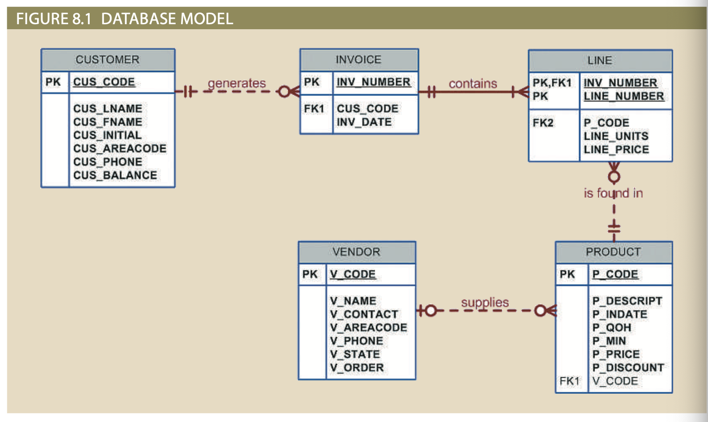
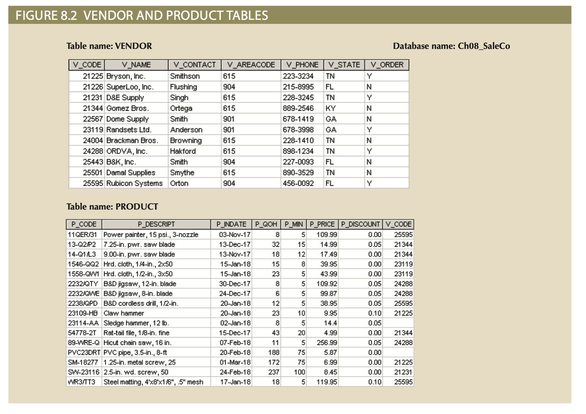
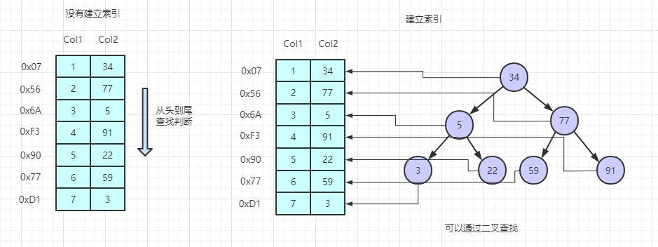

# Chapter8: Advanced SQL

- Learn how to create a table and modify columns and constrains
- Learn how to manipulate the contents of the data, using SQL commands to insert, update, and delete rows of data
- Learn how to use triggers and stored procedures to perform actions when a specific event occurs.
- Learn how SQL facilitates the application of business procedures when it is embedded in a programming language (Python as example).

# Steps to Develop Database

1. Design ER model
2. Create database
3. Create database **schema** (a logical group of database objects, like tables and indexes)
4. Insert data

# Design ER model



# Create Database and Insert Data



# Create Table Syntax

```sql
CREATE TABLE tablename (
column1 data type [constraint] [,
column2 data type [constraint] ] [,
PRIMARY KEY (column1 [, column2]) ] [,
FOREIGN KEY (column1 [, column2]) REFERENCES tablename (column1 [, column2])] [,
CONSTRAINT constraint ] );
```

# Creating VENDOR Table

```sql
CREATE TABLE VENDOR (
V_CODE 		INTEGER,
V_NAME 		VARCHAR(35) NOT NULL,
V_CONTACT 	VARCHAR(15) NOT NULL,
V_AREACODE 	CHAR(3) NOT NULL,
V_PHONE 	CHAR(8) NOT NULL,
V_STATE 	CHAR(2) NOT NULL,
V_ORDER 	CHAR(1) NOT NULL,
PRIMARY KEY (V_CODE)); 
```

# Creating PRODUCT Table

```sql
CREATE TABLE PRODUCT (
P_CODE 	        VARCHAR(10),
P_DESCRIPT 	VARCHAR(35) NOT NULL,
P_INDATE 	DATETIME NOT NULL,
P_QOH 	        INTEGER NOT NULL,
P_MIN 		INTEGER NOT NULL,
P_PRICE 	NUMERIC(8,2) NOT NULL,
P_DISCOUNT 	NUMERIC(4,2) NOT NULL,
V_CODE 		INTEGER,
PRIMARY KEY (P_CODE)
FOREIGN KEY (V_CODE) REFERENCES VENDOR (V_CODE));
```

# The Order of Related Table Creation

- Because the PRODUCT table contains a foreign key that references the VENDOR table, create the VENDOR table first
- “M” side of a relationship always references the “1” side. Therefore, in a 1:M relationship, we always create the table for the “1” side first.
- Data insertion follow the same rule

# Set SQL Constraints when Table Creating

- `<span class="blue-text">`PRIMARY KEY constraint : not null and unique
- `<span class="blue-text">`FOREIGN KEY constraint
  `<span class="small-text">`
  - You cannot delete a vendor from the VENDOR table if at least one product row references that vendor
  - *FOREIGN KEY (V_CODE) REFERENCES VENDOR (V_CODE) ON UPDATE CASCADE*
  - If you make a change in any VENDOR’s V_CODE that change is automatically applied to PRODUCT to maintain referential integrity
- `<span class="blue-text">`NOT NULL constraint
- `<span class="blue-text">`UNIQUE constraint
- `<span class="blue-text">`DEFAULT constraint
- `<span class="blue-text">`CHECK constraint: validate data when an attribute value is entered
  `<span class="small-text">`
  - CUS_AREACODE CHAR(3) DEFAULT '615' NOT NULL CHECK(CUS_AREACODE IN ('615', '713', '931'))

# Create Table INVOICE, LINE to Illustrate Constrains

```sql
CREATE TABLE IF NOT EXISTS INVOICE (
  INV_NUMBER  INTEGER,
  CUS_CODE	INTEGER NOT NULL,
  INV_DATE  DATE NOT NULL,
  PRIMARY KEY (INV_NUMBER),
  FOREIGN KEY (CUS_CODE) REFERENCES CUSTOMER (CUS_CODE), 
  CONSTRAINT INV_CK1 CHECK (INV_DATE > '2012-01-01'));
  
  CREATE TABLE LINE (
  INV_NUMBER 	INTEGER NOT NULL,
  LINE_NUMBER	NUMERIC(2,0) NOT NULL,
  P_CODE		VARCHAR(10) NOT NULL,
  LINE_UNITS	NUMERIC(9,2) DEFAULT 0.00 NOT NULL,
  LINE_PRICE	NUMERIC(9,2) DEFAULT 0.00 NOT NULL,
  PRIMARY KEY (INV_NUMBER,LINE_NUMBER),
  FOREIGN KEY (INV_NUMBER) REFERENCES INVOICE (INV_NUMBER) ON DELETE CASCADE,
  FOREIGN KEY (P_CODE) REFERENCES PRODUCT(P_CODE),
  CONSTRAINT LINE_UI1 UNIQUE(INV_NUMBER, P_CODE));
```

# Create a Table with a SELECT Statement

- SQL provides a way to rapidly create a new table based on selected columns and rows of an existing table using a subquery
- All of the data rows returned by the SELECT statement are copied automatically

```sql
CREATE TABLE IF NOT EXISTS PART AS 
    SELECT P_CODE AS PART_CODE, P_DESCRIPT AS PART_DESCRIPT, P_PRICE AS PART_PRICE, V_CODE
    FROM PRODUCT;
```

# SQL Index

- Indexes can be used to improve the efficiency of searches
  and to avoid duplicate column values

```sql
CREATE INDEX P_INDATEX ON PRODUCT(P_INDATE);
DROP INDEX P_INDATEX ON PRODUCT;
CREATE UNIQUE INDEX P_CODEX ON PRODUCT(P_CODE);
DROP INDEX P_CODEX ON PRODUCT;
CREATE INDEX PROD_PRICEX ON PRODUCT(P_PRICE DESC);
DROP INDEX PROD_PRICEX ON PRODUCT;
```

# MySQL Index

- MySQL allows several types of indexes like primary key index, unique index, normal index (non-unique index, ordinary index, index without constraints) and full-text index.
- The indexes improve SELECT queries speed tremendously. but, they do have some considerable disadvantages as well.
- Advantage
  - Query optimization
  - Uniqueness help to avoid duplicate row data.
- Disadvantage
  - Indexes take up disk space
  - Slow down the speed of writing queries, such as INSERT, UPDATE and DELETE

# Illustrate Index

<div class="middle-grid">
    
    
</div>

# Altering Table Structures

- All changes in the table structure are made by using the ALTER TABLE command with three options: ADD, MODIFY, and DROP
- Changing a column’s data type
- Changing a column’s data characteristics
- Adding a column
- Adding primary key, foreign key, and check constraints
- Dropping a column
- Deleting a table from the database

# Changing a Column’s Data Type

```sql
ALTER TABLE PRODUCT
    MODIFY V_CODE CHAR(5);

ALTER TABLE PRODUCT
    MODIFY P_DESCRIPT VARCHAR(10);  

-- if V_CODE is a FOREIGN KEY, it will fail.
-- if V_CODE contains data that cannot be converted, it will fail.
-- if data truncation occurs, it will fail
```

# Changing a Column’s Data Characteristics

```sql
ALTER TABLE PRODUCT
MODIFY P_PRICE DECIMAL(9,2);
```

- Some DBMSs impose limitations on changing data type or data characteristics.
  - Increase (but not decrease) the size of a column
  - Attribute changes can be made only when there is no data in the attribute.

# Adding a Column

```sql
ALTER TABLE PRODUCT
    ADD P_SALECODE CHAR(1);
```

- Do not add NOT NULL as constrain

# Adding Primary Key, Foreign Key, and Check Constraints

```sql
-- 以 PRODUCT 的資料建立 PART --
CREATE TABLE IF NOT EXISTS PART AS 
    SELECT P_CODE AS PART_CODE, P_DESCRIPT AS PART_DESCRIPT, P_PRICE AS PART_PRICE, V_CODE
    FROM PRODUCT;
-- 設定 PART PK --
ALTER TABLE PART
    ADD PRIMARY KEY (PART_CODE);
-- 設定 FK --
ALTER TABLE PART
    ADD FOREIGN KEY (V_CODE) REFERENCES VENDOR (V_CODE);
-- 加入限制條件 --
ALTER TABLE PART
    ADD CHECK (PART_PRICE >= 0);
-- 嘗試一次新增三種約束（主鍵、外鍵、檢查條件）--
ALTER TABLE PART
    ADD PRIMARY KEY (PART_CODE),
    ADD FOREIGN KEY (V_CODE) REFERENCES VENDOR (V_CODE),  
    ADD CHECK (PART_ PRICE >= 0);
```

# Dropping a Column

```sql
ALTER TABLE VENDOR
    DROP COLUMN V_ORDER;
```

# Dropping a Table

```sql
DROP TABLE PART;
```

# Data Manipulation Commands (INSERT)

```sql
INSERT INTO tablename VALUES (value1, value2, …, valuen)

INSERT INTO VENDOR
    VALUES (21225,'Bryson, Inc.','Smithson','615','223-3234','TN','Y');
INSERT INTO VENDOR
    VALUES (21226,'Superloo, Inc.','Flushing','904','215-8995','FL','N');

SELECT * FROM VENDOR

INSERT INTO PRODUCT
    VALUES ('BRT-345','Titanium drill bit','18-Oct-15', 75, 10, 4.50, 0.06, NULL);

INSERT INTO PRODUCT(P_CODE, P_DESCRIPT) 
    VALUES ('BRT-345','Titaniumdrill bit');  
```

# Inserting Table Rows with a SELECT Subquery

```sql
CREATE TABLE PART (
  PART_CODE CHAR(8),
  PART_DESCRIPT CHAR(35),
  PART_ PRICE DECIMAL(8,2),
  V_CODE INTEGER,
  PRIMARY KEY (PART_CODE));

INSERT INTO PART (PART_CODE, PART_DESCRIPT, PART_PRICE, V_CODE)
  SELECT P_CODE, P_DESCRIPT, P_PRICE, V_CODE
  FROM PRODUCT;
```

# Saving Table Changes

- Any changes made to the table contents are not saved on disk until you

1. close database
2. close the program you are using
3. **use the COMMIT command**

- The COMMIT command permanently saves all changes—such as rows added, attributes modified, and rows deleted made to any table in the database.
- The COMMIT command’s purpose is not just to save changes. The ultimate purpose of the COMMIT and ROLLBACK commands is to ensure database update integrity in transaction management.
- By default, MySQL also automatically commits changes with each command. However, if START TRANSACTION or BEGIN is placed at the beginning of a series of commands, MySQL will delay committing the commands until the COMMIT or ROLLBACK command is issued.

# Updating Table Rows

```sql
UPDATE PRODUCT
SET P_INDATE = '2022-01-18'
WHERE P_CODE = '13-Q2/P2';

UPDATE PRODUCT
SET P_INDATE = '2022-01-18', P_PRICE = 17.99, P_MIN = 10
WHERE P_CODE = '13-Q2/P2';

UPDATE PRODUCT
SET P_SALECODE = '1'
WHERE P_CODE IN ('2232/QWE', '2232/QTY');

-- SET SQL_SAFE_UPDATES = 0;
UPDATE PRODUCT
SET P_PRICE = P_PRICE * 1.10
WHERE P_PRICE < 50.00
```

# Deleting Table Rows

```sql
DELETE FROM PRODUCT
WHERE P_CODE = 'BRT-345';
```

# Restoring Table Contents

The **ROLLBACK** command is used to restore the database table contents to the condition that existed after the last COMMIT statements.

# Transaction Example

A transaction: Jacky transfer $100 to Andy

```sql
CREATE TABLE IF NOT EXISTS ACCOUNT (
  ACCT_NUM  CHAR(5),
  OWNER_NAME  VARCHAR(15),
  BALANCE DECIMAL(9,2),
  PRIMARY KEY (ACCT_NUM));
INSERT INTO ACCOUNT VALUES ('00001','Jacky', 1000);
INSERT INTO ACCOUNT VALUES ('00002','Andy', 500);
SET AUTOCOMMIT = 0;
UPDATE ACCOUNT SET BALANCE = (BALANCE - 100)
WHERE ACCT_NUM = '00001';
UPDATE ACCOUNT SET BALANCE = (BALANCE + 100)
WHERE ACCT_NUM = '00002';
ROLLBACK;
COMMIT;
SET AUTOCOMMIT = 1;
```

# Virtual Tables: Creating a View

- A view is a virtual table based on a SELECT query that is saved as an object in the database
- A base table is the table on which a view is based

```sql
CREATE VIEW PROD_STATS AS
SELECT V_CODE, 
       SUM(P_QOH*P_PRICE) AS TOTCOST, 
       MAX(P_QOH) AS MAXQTY, 
       MIN(P_QOH) AS MINQTY, 
       AVG(P_QOH) AS AVGQTY
FROM PRODUCT
GROUP BY V_CODE;

SELECT * 
FROM PROD_STATS
```

# MySQL View

In MySQL, a VIEW is a virtual table based on the result of a SELECT query. It does not store data, but presents data from one or more tables in a structured way.

<style scoped>
table {
  font-size: 20px;
}
</style>

| Rule / Feature              | Description                                                                                                                      |
| --------------------------- | -------------------------------------------------------------------------------------------------------------------------------- |
| Virtual Table               | Views do not store data — only the SQL logic is saved.                                                                          |
| Read-Only or Updatable      | Simple views (from one table, no aggregates, no DISTINCT, no GROUP BY, etc.) are usually updatable. Complex views are read-only. |
| Column Aliases Allowed      | You can rename columns in the view.`<br>`CREATE VIEW view_name (alias1, alias2) AS SELECT col1, col2 FROM table_name;          |
| Nested Views                | Allow to create a view based on another view.                                                                                    |
| View Dependencies           | Dropping an base table breaks the view.                                                                                          |
| Indexed Views Not Supported | Views in MySQL cannot have indexes.                                                                                              |

# Auto Increment in MySQL

- In MySQL, you may set one and only one column with the AUTO_INCREMENT property. If you set one, the column must be defined as the primary key of the table

```sql
-- In MySQL
create table arena (
    arena_id          int  auto_increment,
    arena_name        varchar(100),
    location          varchar(100),
    seating_capacity  int,
    primary key (arena_id));
-- Loading the data without having to manage arena_id column
insert into arena (arena_name, location, seating_capacity)
values ('Madison Square Garden', 'New York', 20000);
insert into arena (arena_name, location, seating_capacity)
values ('Dean Smith Center', 'North Carolina', null);
```

# Sequences in Oracle

- In Oracle, a sequence is an object for generating unique segment values for a column

```sql
-- In Oracle
CREATE SEQUENCE CUS_CODE_SEQ START WITH 20010 NO CACHE;

INSERT INTO CUSTOMER
VALUES (CUS_CODE_SEQ.NEXTVAL, 'Connery', 'Sean', NULL, '615', '898-2007', 0.00);
```

# Procedural SQL

- `<span class="blue-text">`Procedural SQL is an extension of SQL that adds procedural programming capabilities (variables, if, loop) to SQL and is designed to run inside the database
- Procedural code is executed as a unit by the DBMS when it is invoked by the end user
- End users can use procedural SQL to create the following:
  - Stored function (or user defined function)
  - Stored procedures
  - Triggers

# State_Population Table

```sql
create database population;
use population;
create table state_population(state varchar(100), population  int);
insert into state_population values ('New York',	19299981);
insert into state_population values ('Texas',			29730311);
insert into state_population values ('California',39613493);
insert into state_population values ('Florida', 	21944577);
insert into state_population values ('New Jersey', 9267130);
insert into state_population values ('Massachusetts', 6893000);
insert into state_population values ('Rhode Island', 1097379);
```

# Procedural SQL Used in Stored Function

```sql
use population;
drop function if exists f_get_state_population;

delimiter //
create function f_get_state_population(state_param varchar(100))
    returns int  -- returns an integer: population
    deterministic -- always return the same output for the same input (important for caching and optimization)
    reads sql data -- read data from the database, not modify it
    begin
        declare population_var int; -- local variable to store the retrieved population.
        select  population
            into    population_var
            from    state_population
            where   state = state_param;
        return(population_var);
    end//
delimiter ;

-- Call function
select f_get_state_population('New York');

-- Call function from a WHERE clause
select  *
from    state_population
where   population > f_get_state_population('New York');
```

# Stored Procedures

- A stored procedure is a named collection of procedural and SQL statements
- Stored procedures substantially reduce network traffic and increase performance
- Stored procedures help reduce code duplication by means of code isolation and code sharing

# Country_Population Table

```sql
use population;
create table county_population (state char(50), county varchar(100), population int);

insert into county_population values ('New York',	'Kings',		2736074);
insert into county_population values ('New York',	'Queens',		2405464);
insert into county_population values ('New York',	'New York',		1694251);
insert into county_population values ('New York',	'Suffolk',		1525920);
insert into county_population values ('New York',	'Bronx',		1472654);
insert into county_population values ('New York',	'Nassau',		1395774);
insert into county_population values ('New York',	'Westchester',	1004457);
```

# Procedural SQL Used in Stored Procedures

```sql
use population;
drop procedure if exists p_set_and_show_state_population;

delimiter //
create procedure p_set_and_show_state_population(in state_param varchar(100))
    begin
        declare population_var int;
        delete from state_population where state = state_param;
        select sum(population) into   population_var
            from   county_population
            where  state = state_param;
        insert into state_population(state,population) values(state_param, population_var);
        select concat('Setting the population for ', state_param, ' of ', population_var);
    end//
delimiter ;

-- Call the p_set_and_show_state_population() procedure
set SQL_SAFE_UPDATES = 0;
call p_set_and_show_state_population('New York');
set SQL_SAFE_UPDATES = 1;
```

# Compare Stored Function and Stored Procedure

| Use Case                              | Stored Procedure | Stored Function       |
| ------------------------------------- | ---------------- | --------------------- |
| Modify data (INSERT, UPDATE, DELETE)? | Yes              | No (only SELECT)      |
| Return value?                         | Out parameters   | Return statement      |
| Use inside a SELECT statement?        | No               | Yes                   |
| DETERMINISTIC / NOT DETERMINISTIC?    | Optional         | Yes                   |
| Invocation                            | CALL statement   | within SQL statements |

# Conditional Execution

```sql
use population;
drop procedure if exists p_compare_population;
delimiter //
create procedure p_compare_population(in state_param varchar(100))
    begin
        declare state_population_var int;
        declare county_population_var int;
        select  population into state_population_var
            from    state_population
            where   state = state_param;
        select sum(population) into county_population_var
            from   county_population
            where  state = state_param;
        if (state_population_var = county_population_var) then
            select 'The population values match';
        else
            select 'The population values are different';
        end if; -- If you want to display one of THREE messages, use the if/elseif/else
    end//
delimiter ;
call p_compare_population('New York'); -- Call the p_compare_population() procedure
```

# Iteration or Looping

```sql
use population;
drop procedure if exists p_more_sensible_loop;
delimiter //
create procedure p_more_sensible_loop()
    begin
        declare cnt int default 0;
        msl: loop
            select concat('Looping Again ', cnt);
            set cnt = cnt + 1;
            if cnt = 3 then 
                leave msl;
            end if;
        end loop msl;
    end//
delimiter ;

-- Call the procedure p_more_sensible_loop()
call p_more_sensible_loop();
```

# SELECT Processing with Cursors

- A cursor is a special construct used to hold data rows returned by a SQL query
- To create an explicit cursor, you use the following syntax:
  DECLARE cursor_name CURSOR FOR select-query;
- Cursor-style processing involves retrieving data from the cursor one row at a time and copied to variables

# Cursor Example (p_split_big_ny_counties.sql)

```sql
drop procedure if exists p_split_big_ny_counties;
delimiter //
create procedure p_split_big_ny_counties()
    begin
        declare  v_state       varchar(100);
        declare  v_county      varchar(100);
        declare  v_population  int;
        declare done bool default false;
        declare cnt int default 1;
        declare county_cursor cursor for select  state, county, population
                                         from    county_population
                                         where   state = 'New York' and population > 2000000;
        declare continue handler for not found set done = true;   
        open county_cursor;
        fetch_loop: loop
            fetch county_cursor into v_state, v_county, v_population;
            if done then
                leave fetch_loop;
            end if;
            set cnt = 1;
            split_loop: loop
                insert into county_population (state, county, population)
                    values (v_state,concat(v_county,'-',cnt), round(v_population/2));
                set cnt = cnt + 1;
                if cnt > 2 then
                    leave split_loop;
                end if;
            end loop split_loop;
  
            -- delete the original county
            delete from county_population where state = v_state and county = v_county;
        end loop fetch_loop;
        close county_cursor;
end//
delimiter ;
set SQL_SAFE_UPDATES = 0;
call p_split_big_ny_counties;
set SQL_SAFE_UPDATES = 1;
```

# Stored Procedures with Parameters

- One of the most valuable features of working with stored procedures is their ability to use parameters
- A parameter is a value that is provided to the program at the time of execution

<div class="middle-grid">
    
</div>

# Procedural SQL Used in Triggers

A trigger is a procedural SQL code automatically invoked by the relational DBMS when a data manipulation event occurs

- Trigger is invoked before or after a row is inserted, updated, or deleted (not select)
  - Fire trigger after rows are changed: audit data
  - Fire trigger before rows are changed: affect data
- A trigger is associated with a database table
- Each database table may have one or more triggers
- A trigger is executed as part of the transaction that triggered it
- Triggers are critical to proper database operation and management

# Triggers After Row Changed That Audit Data

Using triggers to track changes to a table (payable) by creating another audit table (payable_audit) that logs who change what and when.

- After insert triggers
- After delete triggers
- After update triggers

# Accounting Database

Table payable and payable_audit

```sql
create database accounting;
use accounting;
create table payable
	(payable_id  int,
	 company  varchar(100),
	 amount  numeric(8,2),
	 service  varchar(100));
insert into payable
	(	payable_id, company, amount, service)
values
	(1, 'Acme HVAC', 		 	 123.32,	'Repair of Air Conditioner'),
	(2, 'Initech Printers',		1459.00,	'New Printers'),
	(3, 'Hooli Cleaning',		4398.55,	'Janitorial Services');
create table payable_audit
	(audit_datetime	datetime,
	audit_user varchar(50),
	audit_change varchar(500));
```

# After Insert Triggers

Naming convention: tr_payable_ai = trigger payable after insert

```sql
drop trigger if exists tr_payable_ai;
delimiter //
create trigger tr_payable_ai after insert on payable
for each row
begin
  insert into payable_audit
	(audit_datetime,
   audit_user,
   audit_change)
  values
  (now(), user(), 
	 concat(
	   'New row for payable_id ', new.payable_id,
		 '. Company: ', new.company,
		 '. Amount: ', new.amount,
		 '. Service: ', new.service));
end//
delimiter ;
```

# Test Trigger: tr_payable_ai

```sql
-- Insert a row into the payable table to test the insert trigger
insert into payable
	(payable_id, company, amount, service)
values
	(4, 'Sirius Painting', 451.45, 'Painting the lobby');

-- Did a row get logged in the payable_audit table showing what was inserted into the payable table?
select * from payable_audit;
```

# After Delete Triggers

```sql
use accounting;
drop trigger if exists tr_payable_ad;
delimiter //
create trigger tr_payable_ad after delete on payable
for each row
begin
  insert into payable_audit
    (audit_datetime, audit_user, audit_change)
  values
    (now(), user(),
     concat(
        'Deleted row for payable_id ', old.payable_id,
        '. Company: ', old.company,
        '. Amount: ', old.amount,
        '. Service: ', old.service));
end//
delimiter ;
```

# Test Trigger: tr_payable_ad

```sql
delete from payable where company = 'Sirius Painting';

select * from payable_audit;
```

# After Update Triggers

```sql
delimiter //
create trigger tr_payable_au after update on payable
for each row
begin
  set @change_msg = 
	concat('Updated row for payable_id ', old.payable_id);
  if (old.company != new.company) then
    set @change_msg = 
	  concat(@change_msg, '. Company changed from ', old.company, ' to ', new.company);
  end if;
  if (old.amount != new.amount) then
    set @change_msg = 
	  concat(@change_msg, '. Amount changed from ', old.amount, ' to ', new.amount);
  end if;
  if (old.service != new.service) then
    set @change_msg = 
	  concat(@change_msg, '. Service changed from ', old.service, ' to ', new.service);
  end if;
  insert into payable_audit
	(audit_datetime, audit_user, audit_change)
  values(now(), user(), @change_msg);
end//
delimiter ;
```

# Test Trigger: tr_payable_au

```sql
update payable
set    amount = 100000,
       company = 'House of Larry'
where  payable_id = 3;

-- Did the update get logged?
select * from payable_audit;
```

# Triggers Before Row Changed That Affect Data

- Before insert triggers
- Before delete triggers
- Before update triggers

# Bank Database

Table credit

```sql
create database bank;

use bank;

create table credit
	(
	customer_id		int,
	customer_name	varchar(100),
	credit_score	int
	);
```

# Before Insert Trigger

```sql
drop trigger if exists tr_credit_bi;
delimiter //
create trigger tr_credit_bi before insert on credit
for each row
begin
  if (new.credit_score < 300) then
	set new.credit_score = 300;
  end if;
  
  if (new.credit_score > 850) then
	set new.credit_score = 850;
  end if;
 end//

delimiter ;
```

# Test Trigger tr_credit_bi

```sql
insert into credit
	(
	customer_id,
	customer_name,
	credit_score
	)
values
	(1,	'Milton Megabucks',	  987),
	(2,	'Patty Po', 		  145),
	(3, 'Vinny Middle-Class', 702);
```

# Before Update Trigger

```sql
drop trigger if exists tr_credit_bu;
delimiter //
create trigger tr_credit_bu before update on credit
for each row
begin
  if (new.credit_score < 300) then
	set new.credit_score = 300;
  end if;
  
  if (new.credit_score > 850) then
	set new.credit_score = 850;
  end if;
 end//

delimiter ;
```

# Test Trigger tr_credit_bu

```sql
set sql_safe_updates = 0;

update credit
set credit_score = 1111
where customer_id = 3;

set sql_safe_updates = 1;

```

# Before Delete Trigger

```sql
drop trigger if exists tr_credit_bd;
delimiter //
create trigger tr_credit_bd before delete on credit
for each row
begin
  if (old.credit_score > 750) then
  -- Raises a custom error to prevent deletion.
  -- '45000' is a custom error state in MySQL, meaning “unhandled user-defined exception”.
    signal sqlstate '45000' set message_text = 'Cannot delete scores over 750';
  end if;
end//
delimiter ;
```

# Test Trigger tr_credit_bd

```sql
set sql_safe_updates = 0;

delete from credit where customer_id = 1;
delete from credit where customer_id = 2;

set sql_safe_updates = 1;
```

# Embedded SQL

- Embedded SQL are SQL statements contained within an application programming language like Python, C, COBOL

```python
# install package mysql-connector-python from PyPI
import mysql.connector
conn = mysql.connector.connect(
    host = '127.0.0.1',
    user = 'dbms_demo',
    password = '12345',
    database= 'EPPS_SALECO')
cursor = conn.cursor()
query = '''SELECT P_CODE, P_DESCRIPT FROM PRODUCT;'''
cursor.execute(query)
results = cursor.fetchall()
for result in results:
    print(result)
```

# Python Embedded SQL

- Install library: `<u>`pip3 install mysql-connector-python`</u>`
- Import library (mysql.connector)
- Build connection
- Create cursor object to interacts with the database
  - Execute SQL queries
  - Fetch query results
  - Manage result sets
- Execute DDL (CREATE TABLE..) and DML (INSERT, SELECT, UPDATE, DELETE)
- Operate return result sets
- Close connection
  [Score manipulate](../Lecture-Database/files/ipynb/scores.ipynb)

# Static SQL vs Dynamic SQL

- Static SQL: embedded SQL which the SQL statements do not change while the application is running

```python
cur.execute("""CREATE TABLE IF NOT EXISTS Name
               (first_name TEXT, last_name TEXT)""")
```

- Dynamic SQL: a program generate SQL statements responding to ad hoc queries

```python
name_list = [('Smith', 'John'), ('Johnson', 'Jane'), ('Lee', 'Samantha'), 
('Patel', 'Raj'), ('Hernandez', 'Maria')]

cur.executemany(""" INSERT INTO Name (first_name, last_name) VALUES (%s, %s)""", name_list)
```

# Create Friend Table and Insert Data

```python
# install package mysql-connector-python from PyPI
import mysql.connector
conn = mysql.connector.connect(
    host = '127.0.0.1',
    user = 'dbms_demo',
    password = '12345',
    database= 'demo')
cursor = conn.cursor()
# static SQL
create_table = """
               CREATE TABLE IF NOT EXISTS friends (first_name TEXT, last_name TEXT)
               """
cursor.execute(create_table)

name_list = [('Smith', 'John'), ('Johnson', 'Jane'), ('Lee', 'Samantha'), 
('Patel', 'Raj'), ('Hernandez', 'Maria')]
# Dynamic SQL
cursor.executemany(""" INSERT INTO friends (first_name, last_name) VALUES (%s, %s)""", name_list)

conn.commit()
```

# Python MySQL Connector Error Types

| Error Type        | Error Code Example               | Cause                   |
| ----------------- | -------------------------------- | ----------------------- |
| InterfaceError    | 2003: Can't connect to MySQL     | Connection failure      |
| DatabaseError     | 1049: Unknown database           | Database does not exist |
| DataError         | 1264: Out of range value         | Invalid data type       |
| OperationalError  | 2006: MySQL server has gone away | Server issue or timeout |
| IntegrityError    | 1062: Duplicate entry            | Primary key violation   |
| ProgrammingError  | 1064: SQL syntax error           | Invalid SQL syntax      |
| NotSupportedError | 1235: Feature not supported      | Unsupported SQL feature |
| InternalError     | 1054: Unknown column             | Internal MySQL issue    |

# Review Questions

- What is the purpose of a CHECK constraint?
  **CHECK 約束**用來限制欄位所能接受的資料範圍或邏輯條件。當輸入資料不符合此條件時，資料庫會拒絕該筆操作（INSERT 或 UPDATE）。

```sql
CHECK (age >= 0 AND age <= 120)
```

- What is the difference between an INSERT command and an UPDATE command?| 指令       | 功能             | 說明                     |
  | ---------- | ---------------- | ------------------------ |
  | `INSERT` | 新增一筆資料     | 用於將新資料加入資料表中 |
  | `UPDATE` | 修改已存在的資料 | 用於更新現有的欄位值     |

```sql
-- 新增一筆學生資料
INSERT INTO student (id, name) VALUES (1, 'Amy');
-- 修改已有學生的名字
UPDATE student SET name = 'John' WHERE id = 1;
```

- What is a stored procedure, and why is it particularly useful?

# Recap SQL Statement

[W3 School SQL Quiz](https://www.w3schools.com/mysql/mysql_quiz.asp)

# Homework #D

資料庫課程作業(D)

# Tips and Tricks

- Working in wrong database
- Using the wrong server
- Leaving where clauses incomplete
- Running partial SQL statement
- Transaction
- Supporting on existing system

# Tip - Working in wrong database

You used Workbench to create an employee table in  distribution database?? Did you?

```sql
create database distribution;
create table employee(
    employee_id int primary key,
    employee_name varchar (100),
    tee_shirt_size varchar (3));
```

```sql
-- ALT1
use distribution;
create table employee (...)
-- ALT2
create table distribution.employee(...);
-- Show database
select database();
show databases;
```

# Tip - Using the Wrong Server

- Sometimes, SQL statements can be executed against the wrong MySQL server. Companies often set up different servers for production and development.
- It's not unusual for a developer to have two windows open: one connected to the production server and one connected to the development server. If you're not careful, you can make changes in the wrong window.
- Purposely separate development and production environment
  - authorized to different team and people (不同團隊及工程師)
  - operated by different PC or notebook (不同工作電腦)
  - open by different working window (不同工作視窗)
  - connected by different names shown in tabs (不同工作分頁)

# Tip - Leaving Where Clauses Incomplete

Looking at a Ford Focus on the lot, you notice that you have it listed a green, but its color is actually closer to blue. You decide to update its color from green to blue in the database.

```sql
-- it update 3 rows. that is wrong
update inventory
set color = 'blue'
where mfg = 'Ford' and model = 'Focus';
#不管什麼顏色的車都被改成藍色了
```

```sql
-- step1 - verify where clause by select
select * 
from inventory
where mfg = 'Ford' and model = 'Focus' and color='green';
--先 select 出來看看資料是不是自己要改的
-- step2: create update statement using correct where clause
update inventory
set color = 'blue'
where mfg = 'Ford' and model = 'Focus' and color='green';
```

# Running Partial SQL Statements

- Execute the selected portion of the script or everything, if there is no selection: Provides a simple way to execute the entire query or a subset of the query.
- Execute the statement under the keyboard cursor: Uses the position the keyboard cursor to identify and execute the query.

```sql
delete from inventory  -- only select this line, then click 'Execute the selected portion'
where vin='4XBCX68RFWE532566'
```

<div class="grid">
    
</div>
<br>

[Workbench toolbar](https://dev.mysql.com/doc/workbench/en/wb-sql-editor-toolbar.html)

# Supporting an Existing System

In workbench, choose menu "Database" to select "Reverse Engineer" function

# Most Common Database Design

- business field as primary key
- storing redundant data
- spaces or quotes in table names
- poor or no referential integrity
- multiple pieces of information in a single field
- storing optional types of data in different columns
- using the wrong data types and sizes
  `<br>`
  [Vedio: Learn 7 of the most common database design mistakes](https://youtu.be/s6m8Aby2at8?si=9xPGZqbksCEIi6pi)

# MySQL Shell

MySQL command line client tool that run SQL, Python or JavaScript commands

> mysqlsh -h localhost -D database_name_here -u user_name_here
> \sql
> select * from employee;
> \quit
